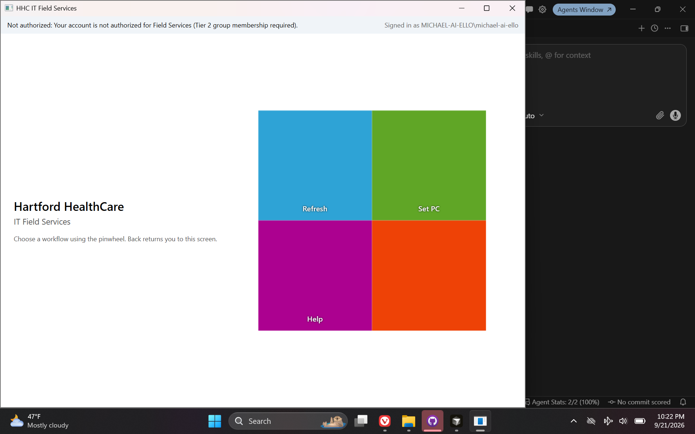
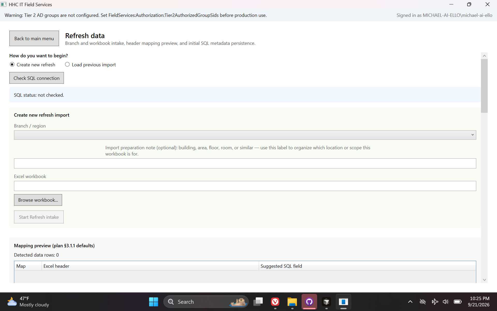
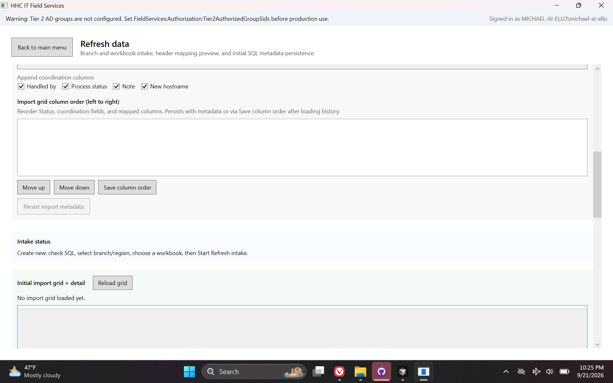
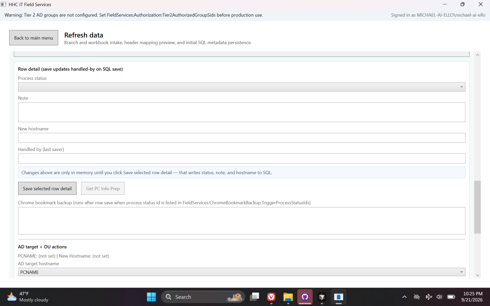
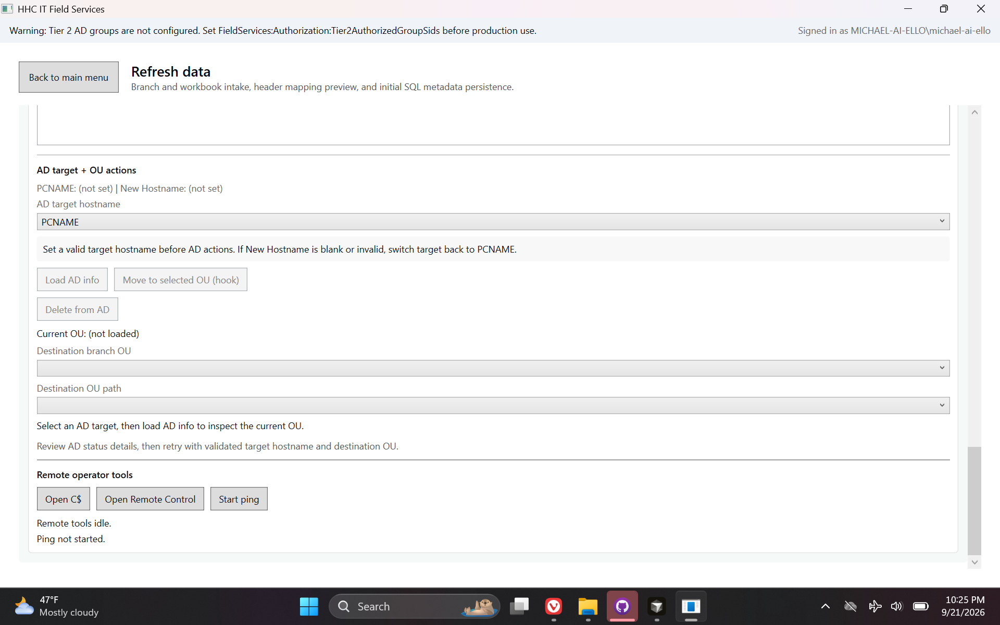
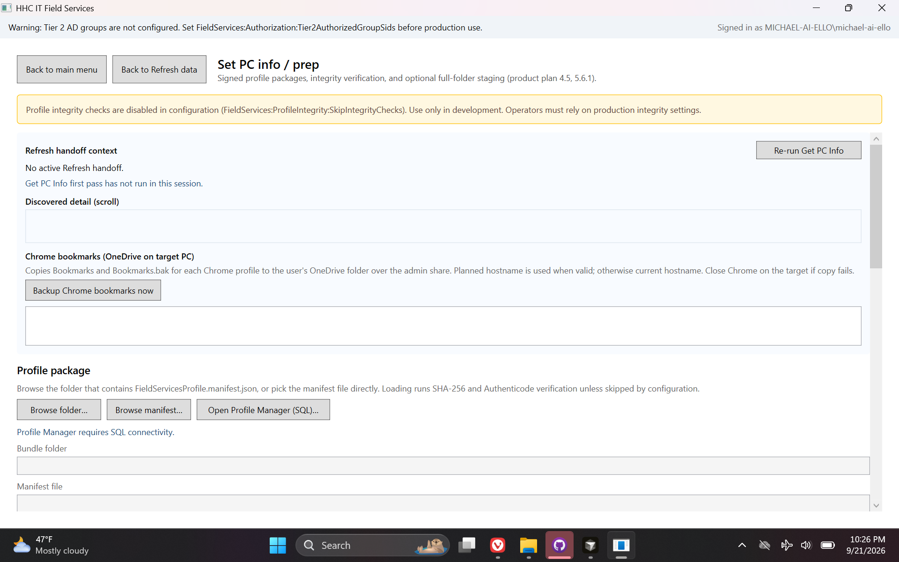
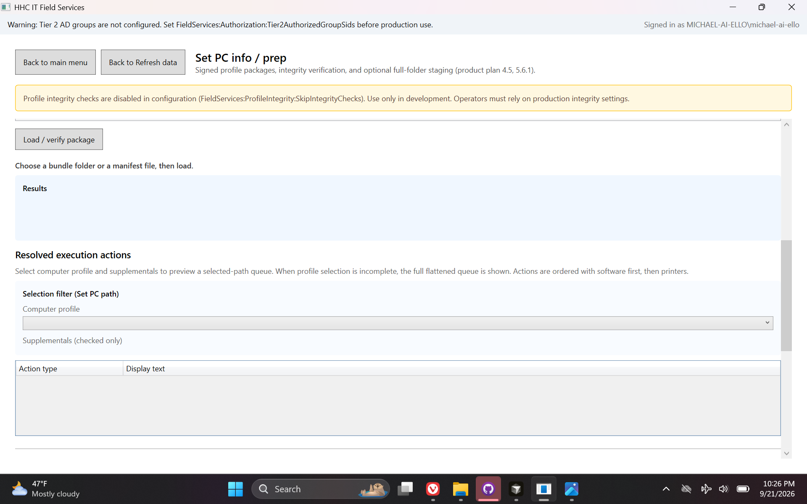
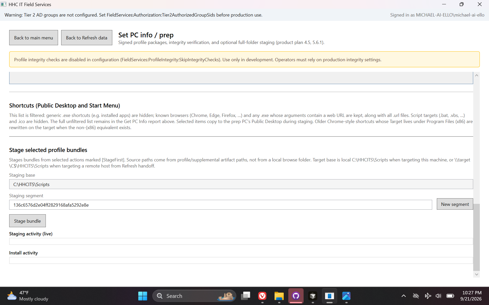

# HHC IT Field Services — Desktop POC

> **Repository:** `HHC-IT-FieldServices-Work-POC` · **Visibility:** private · **Category:** Healthcare & Enterprise Desktop

Native WPF desktop for field operations: Excel import coordination grid, AD tools, and Set PC profile staging with integrity checks.

---

## Inspiration

Built during a nine-month healthcare IT contract to organize laptop and asset deployment prep across regions, departments, and software profiles—replacing ad-hoc coordination with a structured desktop workflow.

## Current State / Phase

Ran successfully alongside real tier-2 domain workflows and collaborative scenarios; proved viability as a side test but was not officially integrated into enterprise release processes.

## Future Directions

Formal packaging, Authenticode signing, and IT-approved deployment paths if brought into production change control.

## Stack Summary

| Area | Details |
|------|---------|
| **Primary languages** | C#, PowerShell, TSQL |
| **Frameworks & libraries** | .NET 10 WPF, Dapper, Active Directory integration |
| **Architecture** | Core / Infrastructure / App split · Stored procedures only · SHA-256 profile manifests |
| **Deployment hints** | Local SQL bootstrap scripts · Staged execution under C:\HHCITS\Scripts · AD group gate |

## Features

- Refresh module (Excel → SQL grid)
- Set PC profile packages
- Remote operator tools
- Authenticode policy path

## Notable Services & Folders

- src/
- database/
- docs/
- scripts/

## Sanitized Directory Overview

High-level layout only — no source files, configs, or secrets are published here.

```
src/ — WPF modules/
database/ — SQL assets/
docs/ — unified plan/
```

## Screenshots / Media

### Primary UI



### Architecture / diagram



### Secondary flow



### Additional view 04



### Additional view 05



### Additional view 06



### Additional view 07



### Additional view 08



---

[← Back to portfolio](../README.md#projects)
