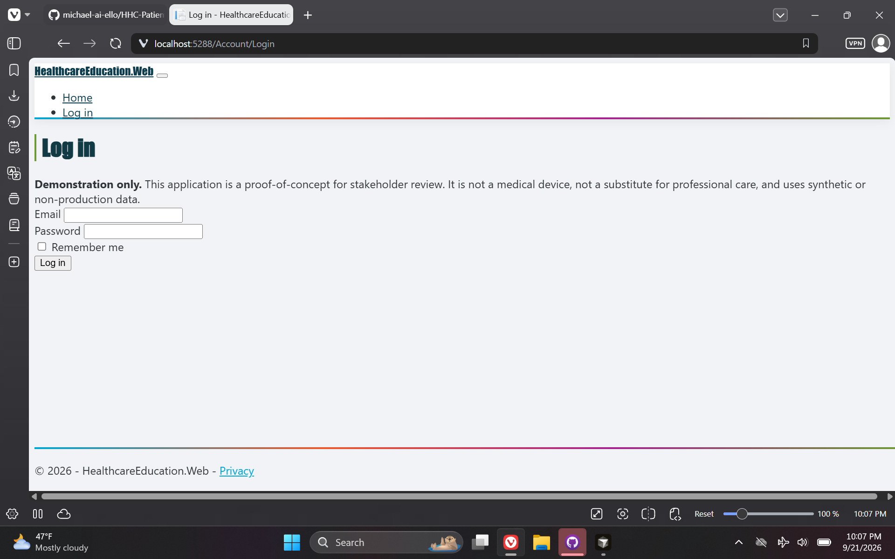
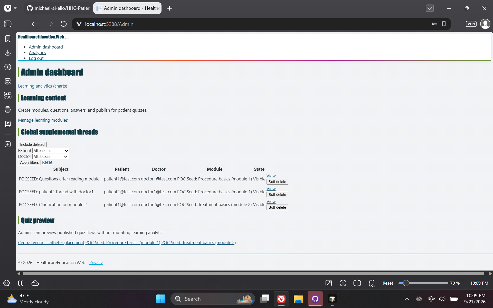
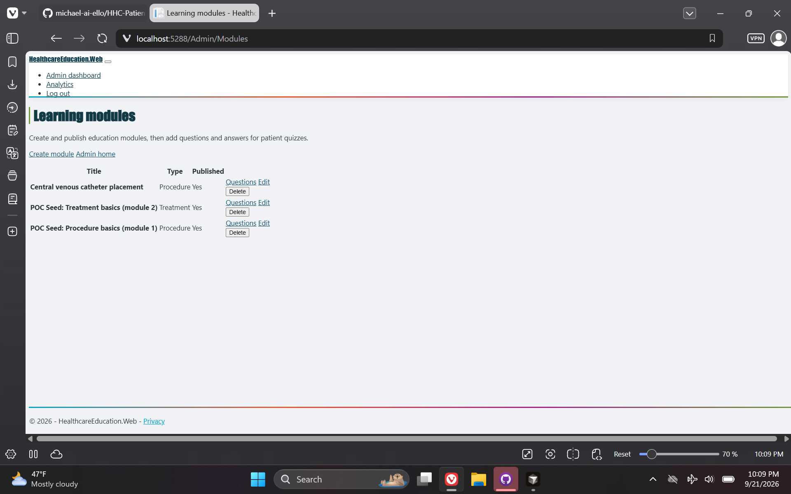
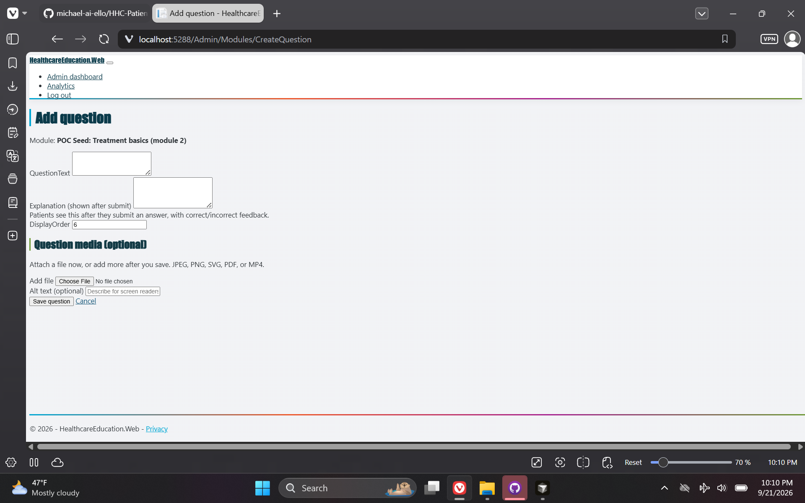
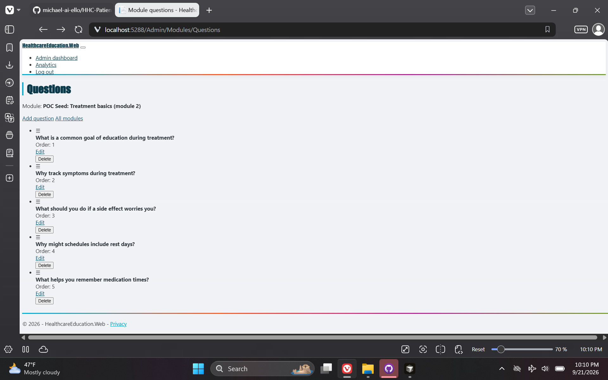
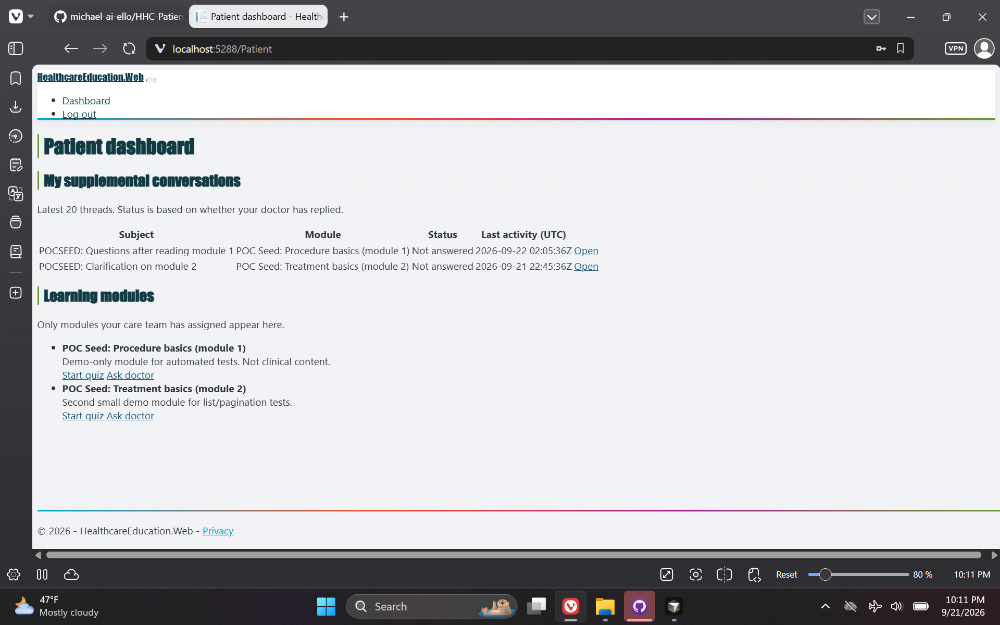
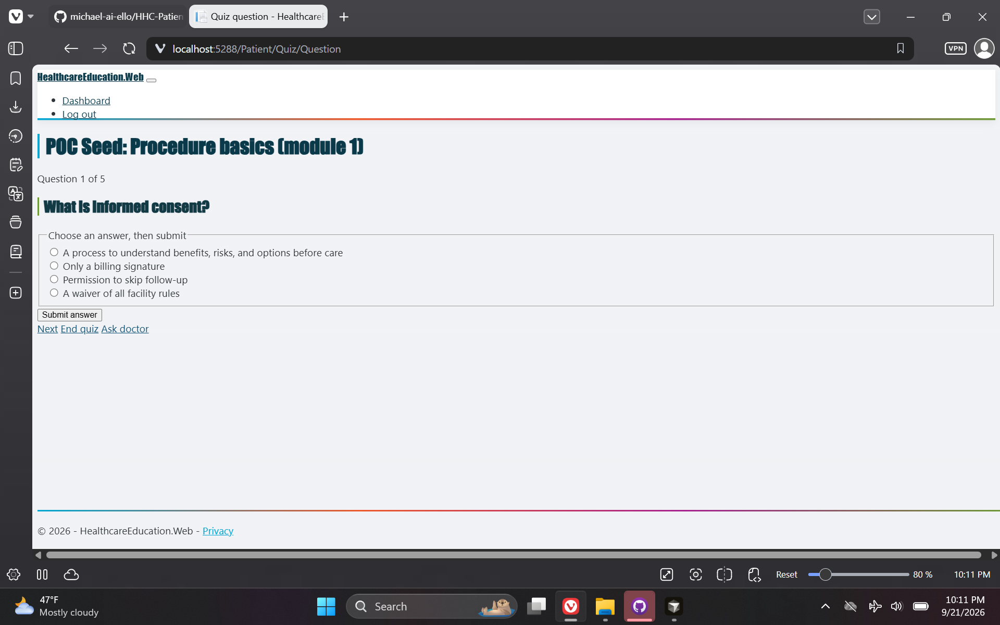
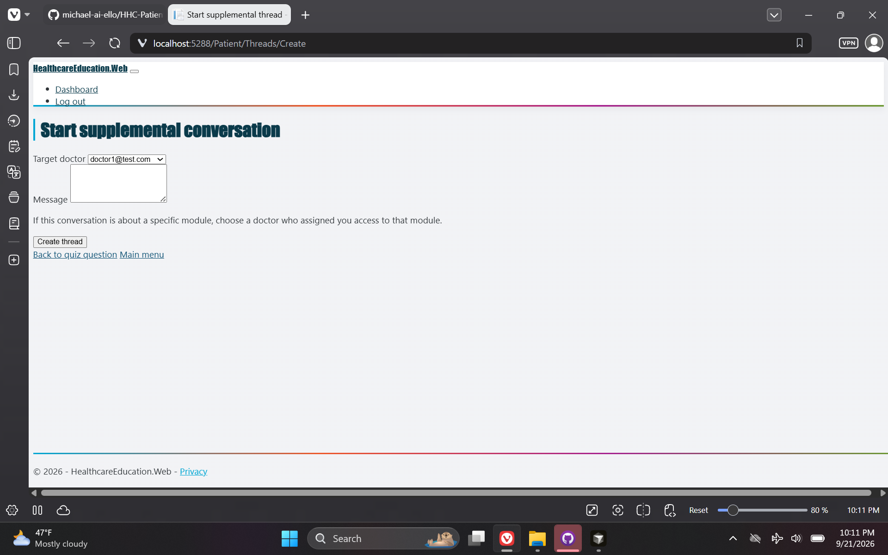
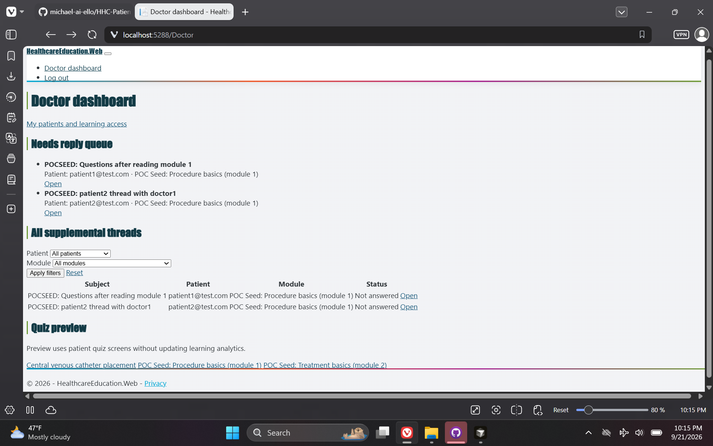
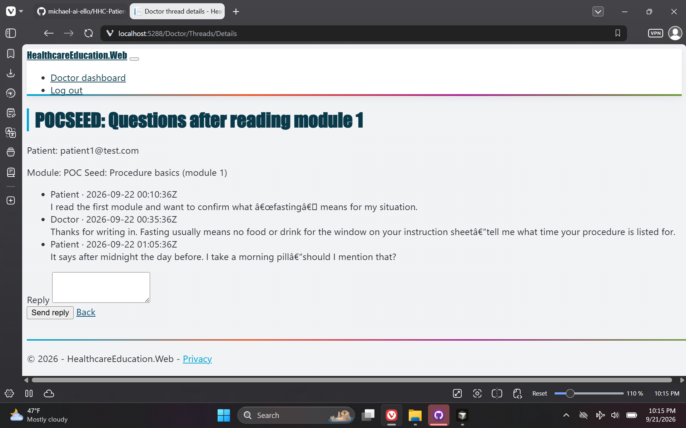

# HHC Patient Education — Healthcare POC

> **Repository:** `HHC-Patient-Education-POC` · **Visibility:** private · **Category:** Healthcare & Enterprise Desktop

Patient education platform POC: ASP.NET Core MVC, interactive modules, quizzes, visual learning, and optional Epic/SMART integration path.

---

## Inspiration

Side project alongside a healthcare IT contract—motivated by patient rights and informed consent. Envisioned quiz-style education synced with real charts and Epic data to improve the patient experience around treatments, procedures, and medications.

## Current State / Phase

Side-development POC with synthetic data; not tied to contract workflows or live EHR feeds.

## Future Directions

Epic/FHIR and chart-backed assignments—the stated next step if the concept were pursued inside a health system.

## Stack Summary

| Area | Details |
|------|---------|
| **Primary languages** | C#, TSQL, HTML, CSS, PowerShell |
| **Frameworks & libraries** | ASP.NET Core MVC, Clean Architecture, Dapper, SMART on FHIR (optional) |
| **Architecture** | Stored procedures only · Epic SQL layer (opt-in branch) · Demo assignment modes |
| **Deployment hints** | User secrets / env connection strings · dbinit.ps1 and dbinit-epic.ps1 · Synthetic accounts only |

## Features

- Education modules and quizzes
- Doctor assignment workflows
- Optional FHIR codings demo
- Clinical-first admin wizard

## Notable Services & Folders

- src/
- db/
- docs/
- scripts/

## Sanitized Directory Overview

High-level layout only — no source files, configs, or secrets are published here.

```
src/ — MVC application layers/
db/ — schema and epic overlays/
docs/ — full specification/
```

## Screenshots / Media

### Primary UI



### Architecture / diagram



### Secondary flow



### Additional view 04



### Additional view 05



### Additional view 06



### Additional view 07



### Additional view 08



### Additional view 09



### Additional view 10



---

[← Back to portfolio](../README.md#projects)
