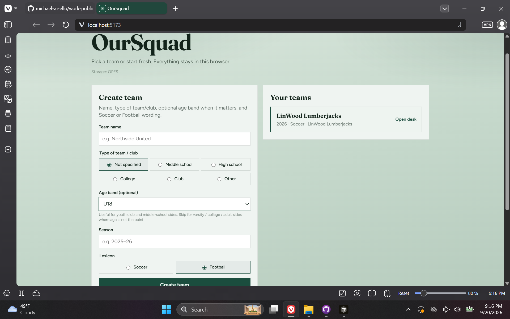
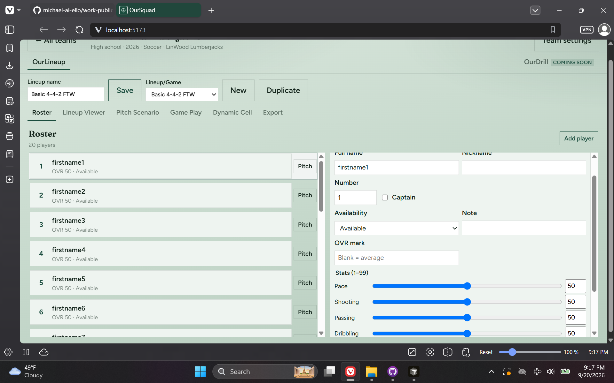
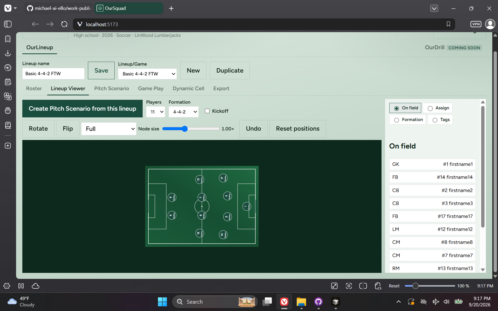
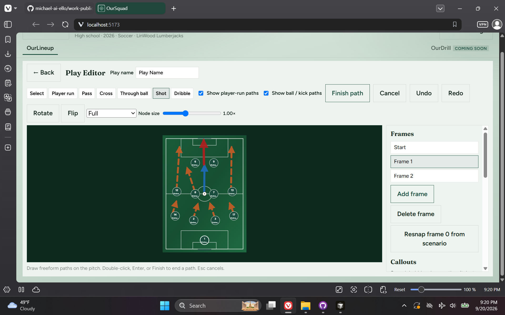
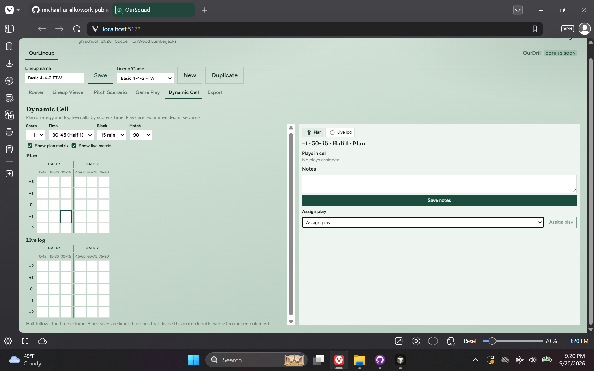
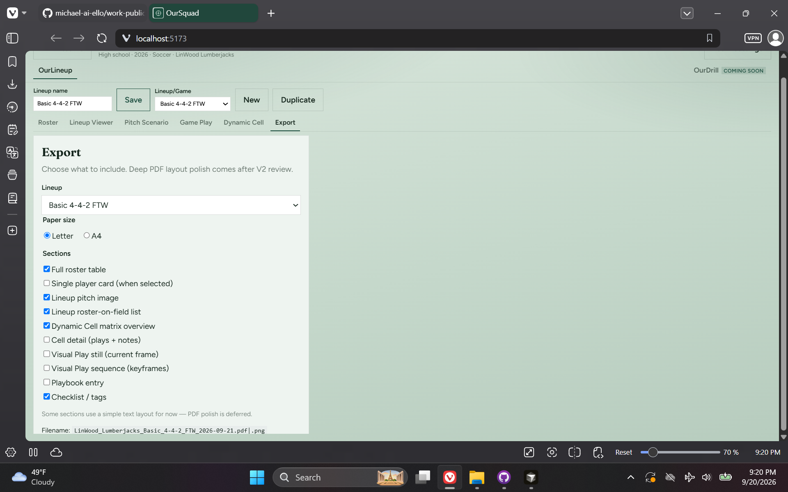

# OurSquad — Local Coaching Workbench

> **Repository:** `OurSquad` · **Visibility:** private · **Category:** Sports & Coaching Tools

Browser-only coaching workbench: build lineups on a pitch, keep a team playbook and visual plays, and stay offline in one tab—no cloud sync, no PWA.

---

## Inspiration

From a part-time volunteer soccer / coaching role, I started thinking through a small side tool for logging and detailing plays, lineups, roster, scenarios, and games—something practical for a coach’s desk without forcing a SaaS account.

## Current State / Phase

**OurLineup** is active: roster, pitch/lineup viewer, dynamic plot, playbook, visual play editor, export inventory, and local persistence. **OurDrill** is a desk-tab placeholder only—practice/drill workflows are the planned next product slice.

## Future Directions

Implement the OurDrill section for practice planning (not only game/lineup work), plus export/import polish for the local database file.

## Stack Summary

| Area | Details |
|------|---------|
| **Primary languages** | TypeScript, CSS, HTML, JavaScript |
| **Frameworks & libraries** | React 19, Vite, sql.js (+ OPFS / IndexedDB fallback), i18next, jsPDF, Vitest |
| **Architecture** | Local-only SPA · Feature folders (teams, players, lineups, pitch, plot, playbook, plays, export) · Flat team identity with Soccer/Football lexicon |
| **Deployment hints** | Node 20+ · `npm run open` for local browser · No backend; wipe phrase in Settings |

## Features

- Roster with link-vs-duplicate player linking across teams
- Pitch lineup viewer and custom formation layers
- Dynamic plot and visual plays (run/kick paths, situations)
- Playbook and play editor with autosave / undo
- Export section inventory (PDF polish deferred)
- Local sql.js persistence (OPFS preferred)

## Notable Services & Folders

- src/features/
- src/db/
- src/domain/
- docs/
- scripts/

## Sanitized Directory Overview

High-level layout only — no source files, configs, or secrets are published here.

```
src/features/ — OurLineup surfaces (roster, pitch, plot, playbook, plays, export)/
src/db/ — sql.js persistence helpers/
src/domain/ — coaching domain models/
docs/ — challenges and visual-play notes/
scripts/ — browser open helpers, wasm copy, seed/reset notes/
```

## Screenshots / Media

### Primary UI



### Architecture / diagram



### Secondary flow



### Additional view 04



### Additional view 05



### Additional view 06



---

[← Back to portfolio](../README.md#projects)
