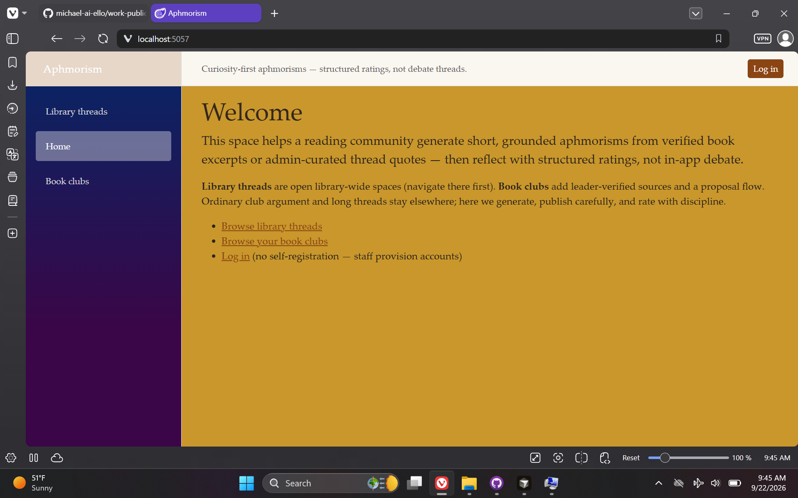
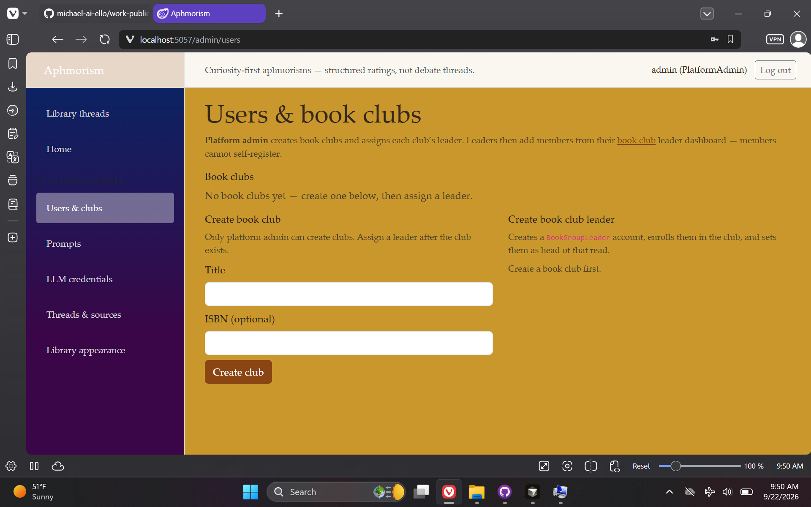
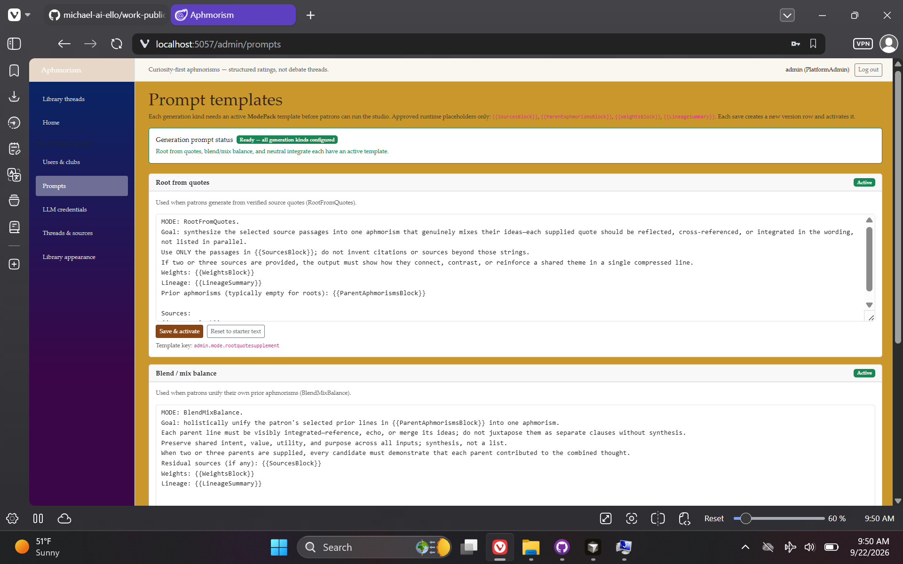
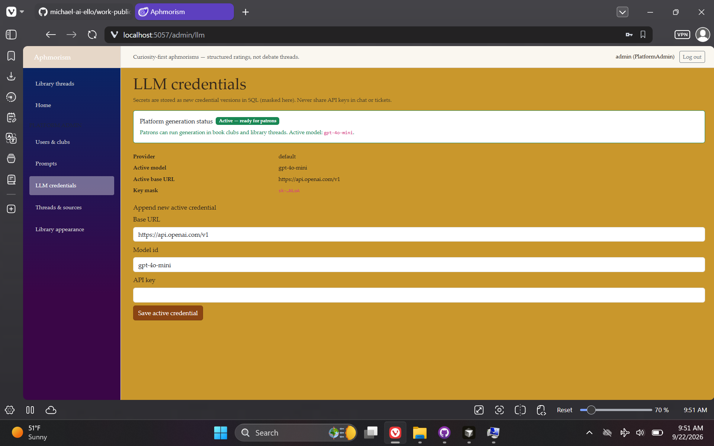
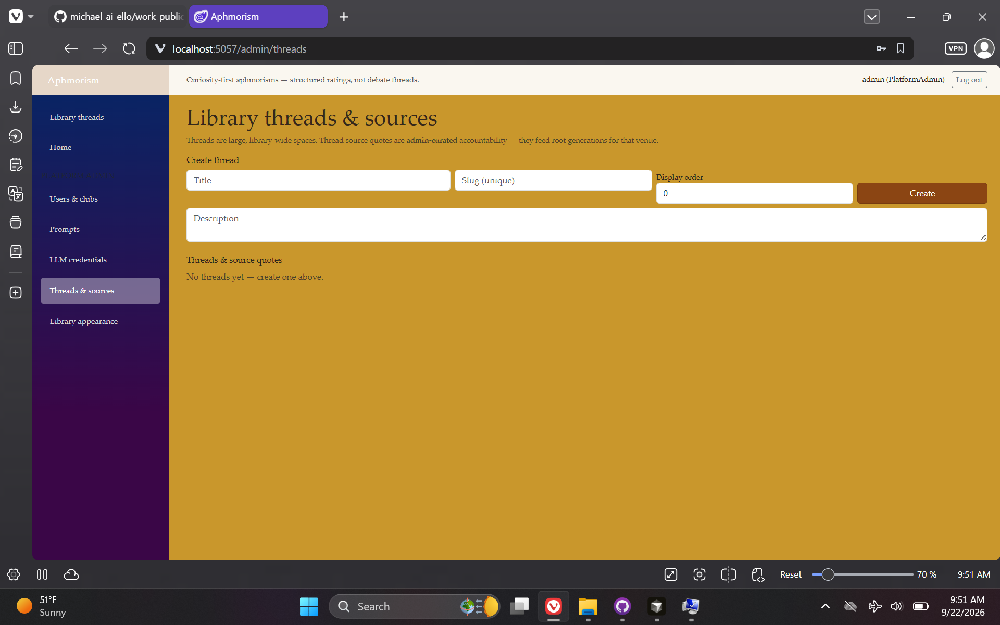
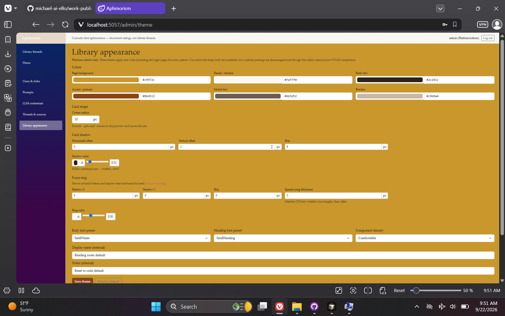
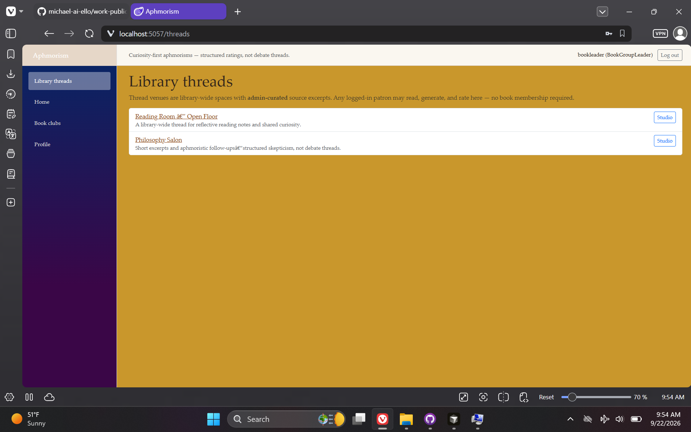
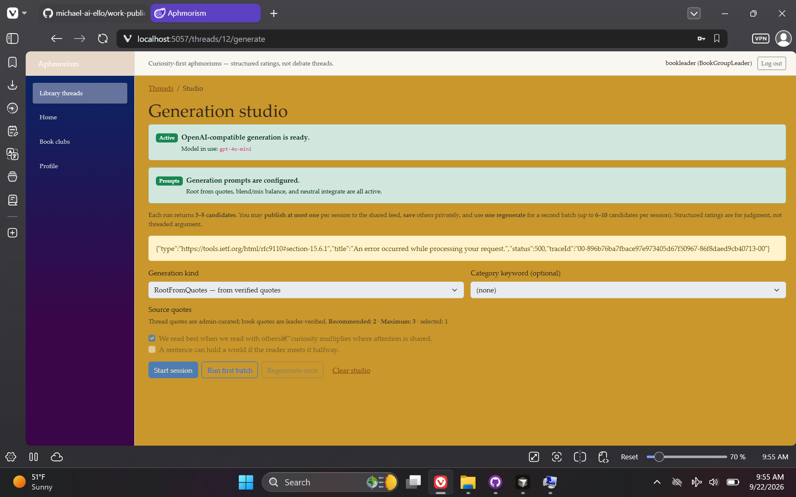
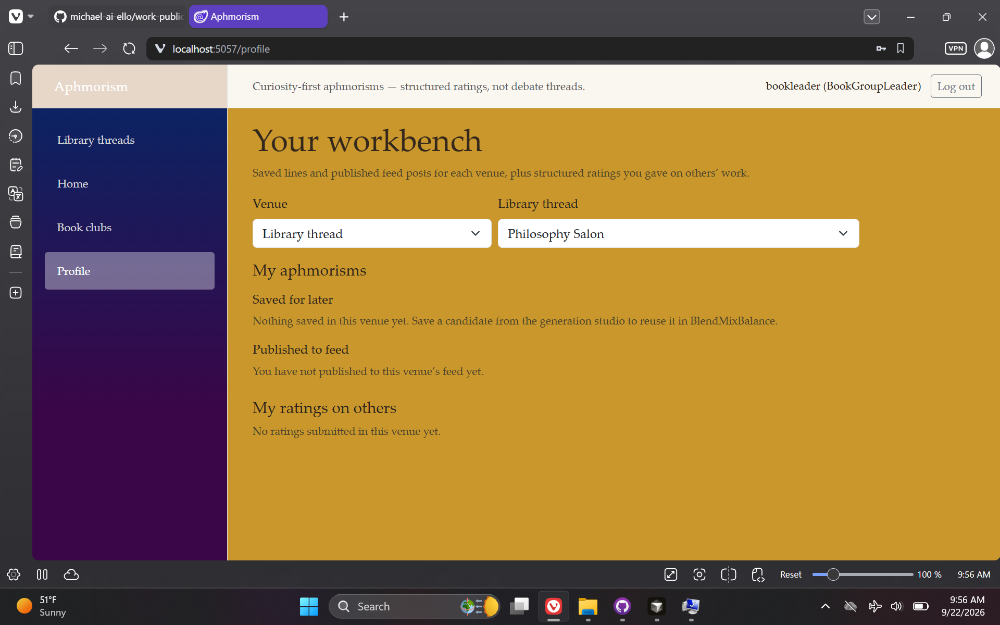

# Aphmorism — AI-Assisted Library POC

> **Repository:** `aphmorism-poc` · **Visibility:** private · **Category:** Edge AI & Embedded

Local-library aphmorism POC: LLM-assisted generation grounded in leader-verified quotes, Blazor UI, and structured patron ratings.

---

## Inspiration

Sparked by a library IT/database admin job application and an interest in philosophy—envisioned a supplemental tool for book clubs to rate AI-generated aphmorisms that synthesize or reconcile quotes from different authors, with humans judging quality rather than replacing live debate.

## Current State / Phase

Core scaffolding and data flows work; earlier phase—OpenAI key integration and live generation testing still outstanding.

## Future Directions

Wire LLM provider configuration, run patron rating sessions end-to-end, and polish library-leader approval workflows.

## Stack Summary

| Area | Details |
|------|---------|
| **Primary languages** | C#, HTML, TSQL, CSS, PowerShell |
| **Frameworks & libraries** | ASP.NET Core, Blazor, Dapper, .NET 10 |
| **Architecture** | Book vs LibraryThread venues · Role-based workflows · Generation session limits |
| **Deployment hints** | SQL Server · LLM credentials via admin config (not published) · Phased ai-cursor-dev plan |

## Features

- Quote proposal approval
- LLM batch generation
- Structured ratings
- Library thread curation

## Notable Services & Folders

- src/
- sql/
- ai-cursor-dev/
- tests/

## Sanitized Directory Overview

High-level layout only — no source files, configs, or secrets are published here.

```
src/ — API and UI/
ai-cursor-dev/ — phased plan/
sql/ — database assets/
```

## Screenshots / Media

Example views from the application:

### Screenshot 1



### Screenshot 2



### Screenshot 3



### Screenshot 4



### Screenshot 5



### Screenshot 6



### Screenshot 7



### Screenshot 8



### Screenshot 9



---

[← Back to portfolio](../README.md#projects)
