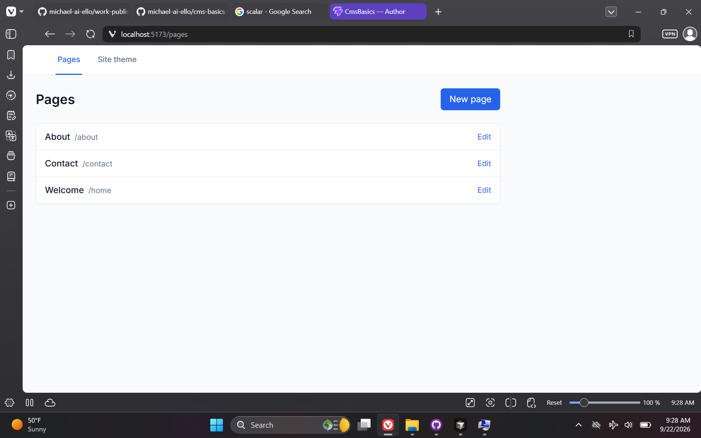
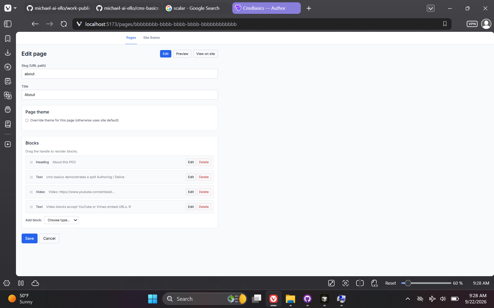
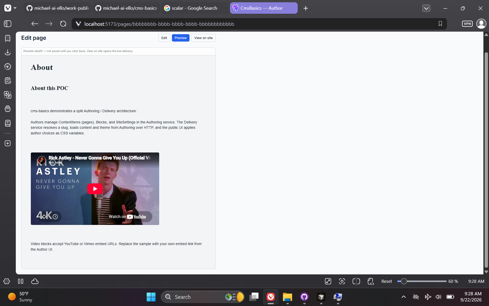
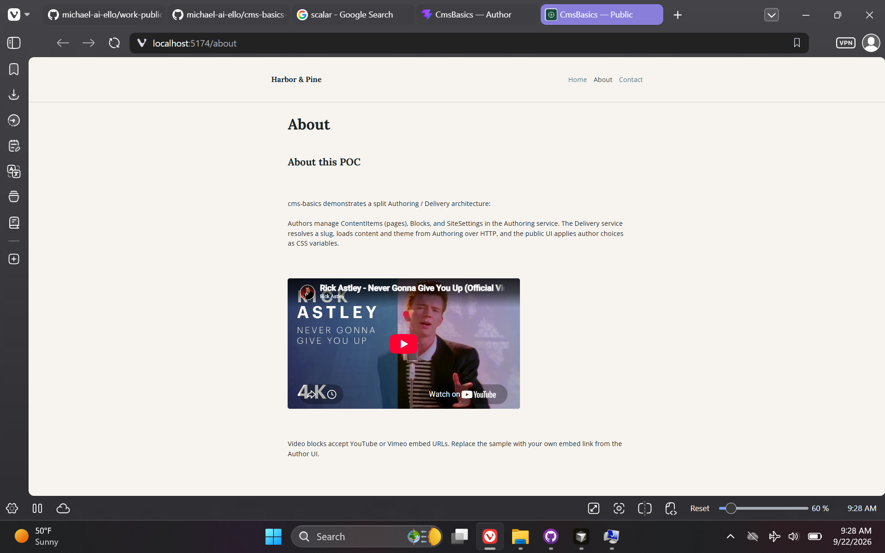
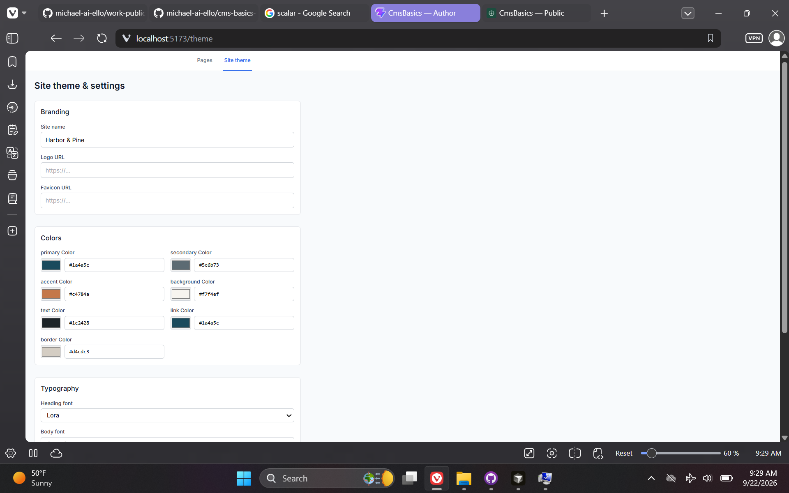

# CMS Basics — Headless Content POC

> **Repository:** `cms-basics-poc` · **Visibility:** private · **Category:** Platform, CMS & Content

Generic CMS POC with separate Authoring and Delivery microservices, React SPAs, and author-editable theming.

---

## Inspiration

Intentionally generic learning project to understand CMS-style interfaces—how client-facing users edit and publish web content without tying the POC to one company's product.

## Current State / Phase

Delivers intended authoring vs delivery separation and theme editing; suitable as a teaching/reference codebase.

## Future Directions

Richer content models, workflow approvals, and hosting patterns for a real tenant.

## Stack Summary

| Area | Details |
|------|---------|
| **Primary languages** | TypeScript, C#, CSS, JavaScript |
| **Frameworks & libraries** | React 19, Vite, Tailwind, EF Core, ASP.NET Core, concurrently |
| **Architecture** | Authoring vs Delivery services · Content by slug API · CSS variable theming |
| **Deployment hints** | npm run dev orchestrates 4 processes · SQL Server LocalDB for authoring DB |

## Features

- Page/block content model
- Site theme editor
- Delivery rendering by slug
- CORS-enabled dev UIs

## Notable Services & Folders

- src/CmsBasics.Authoring/
- src/CmsBasics.Delivery/
- src/author-ui/
- src/delivery-ui/

## Sanitized Directory Overview

High-level layout only — no source files, configs, or secrets are published here.

```
src/CmsBasics.* — .NET services/
src/author-ui/ — admin SPA/
src/delivery-ui/ — public SPA/
```

## Screenshots / Media

Example views from the application:

### Screenshot 1



### Screenshot 2



### Screenshot 3



### Screenshot 4



### Screenshot 5



---

[← Back to portfolio](../README.md#projects)
