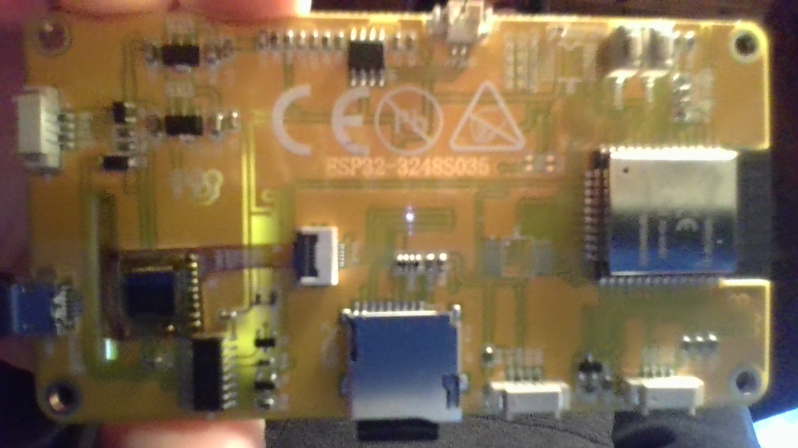
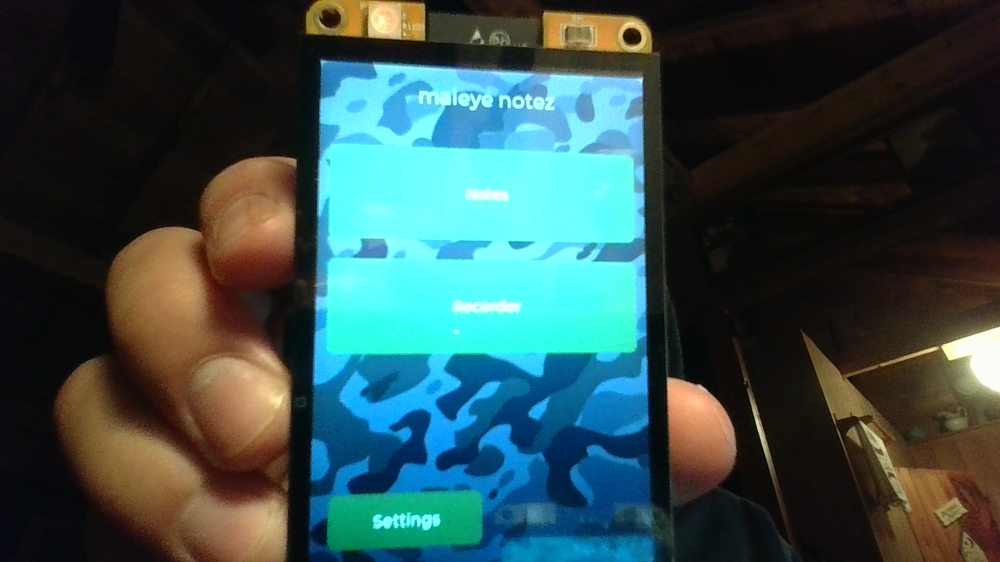
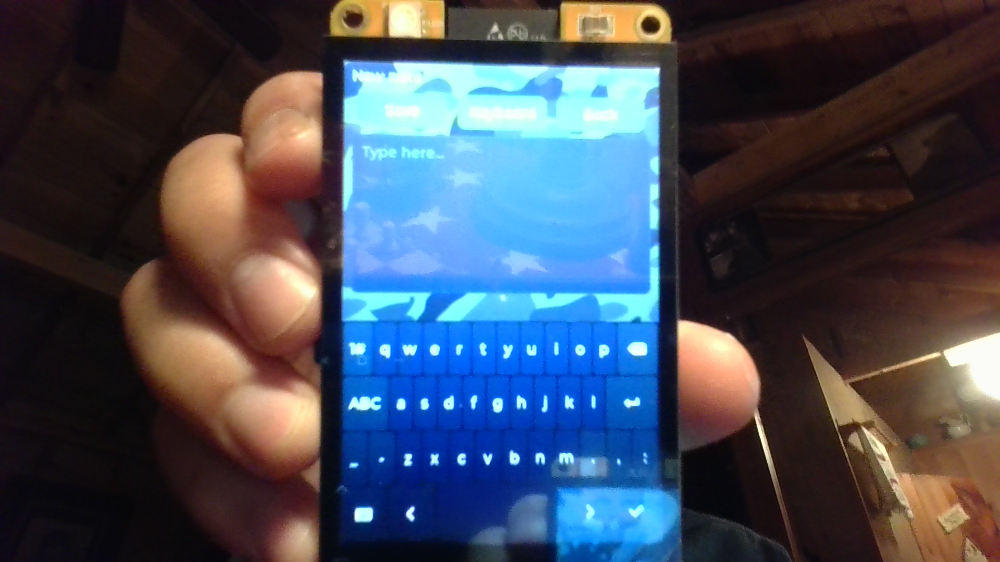

# ESP32 Capacitive Screen — Notes Bring-Up

> **Repository:** `esp-capacitive-screen` · **Visibility:** private · **Category:** Edge AI & Embedded

Bring-up and product sketch for a Sunton/Guition ESP32-3248S035C capacitive touch display: pin maps, one-shot flash tooling, and a simple on-device Notes app with microSD persistence.

---

## Inspiration

With a capacitive ESP32 screen board on the bench, I wanted to learn how these devices actually work—schematics and pin layouts, correct libraries for ST7796 + GT911, and a practical small app rather than only hello-world color bars.

## Current State / Phase

Hardware probe, display/touch tests, phased SD + LVGL Notes bring-up, and a `memo_app` dashboard with working Notes (list/create/edit/save on FAT32 microSD) are in place. Recorder remains a stub; parts needed for audio capture have not been ordered yet.

## Future Directions

Add the audio recorder path once microphone / supporting hardware is available, and keep flash/debug docs current for the C (capacitive) board variant quirks.

## Stack Summary

| Area | Details |
|------|---------|
| **Primary languages** | C++, C, PowerShell |
| **Frameworks & libraries** | Arduino CLI, ESP32 Dev Module board package, LovyanGFX, LVGL 8.3.x, shared board helpers |
| **Architecture** | Phased sketches → product `memo_app` · SD-backed notes · Dashboard with Notes + Recorder stub |
| **Deployment hints** | `scripts/setup-and-flash.ps1` · FAT32 microSD required for Notes · Local COM port only |

## Features

- Board probe (serial, I²C touch presence, RGB)
- Display + capacitive touch smoke test
- Phased SD / LVGL / notes editor bring-up
- Notes app: list, new, edit, resave on `/notes`
- One-shot Windows flash tooling with sketch selection

## Notable Services & Folders

- sketches/
- shared/
- scripts/
- docs/
- assets/

## Sanitized Directory Overview

High-level layout only — no source files, configs, or secrets are published here.

```
sketches/ — board_probe, display_test, phased notes bring-up, memo_app/
shared/ — board LGFX + SD + notes helpers/
scripts/ — one-shot setup and flash/
docs/ — phases and debugging notes/
assets/ui/ — wallpaper sources for SD/
```

## Screenshots / Media

### Hardware bring-up



### Screen assembly



### Device detail



---

[← Back to portfolio](../README.md#projects)
