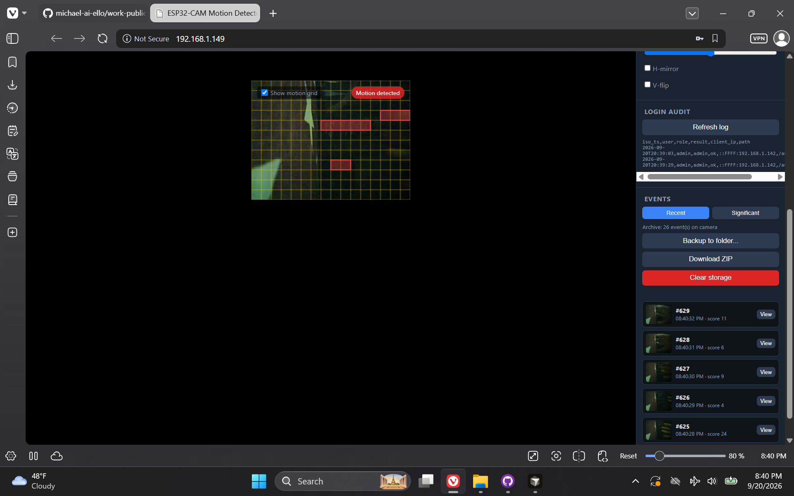
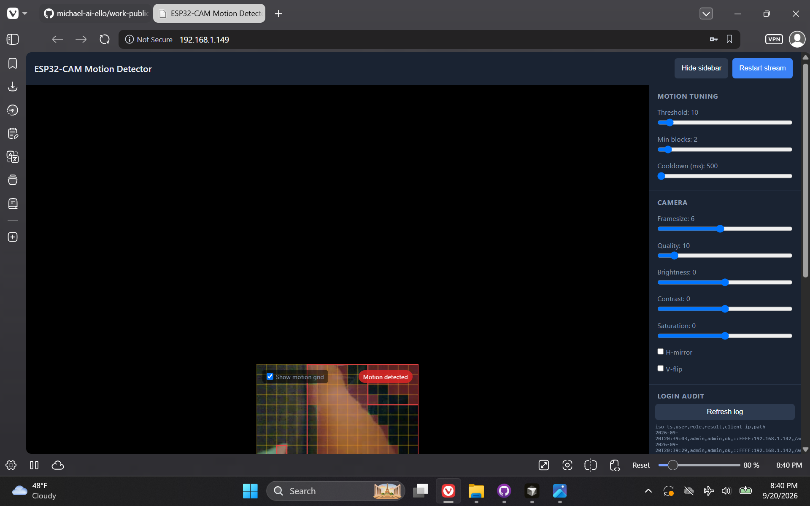
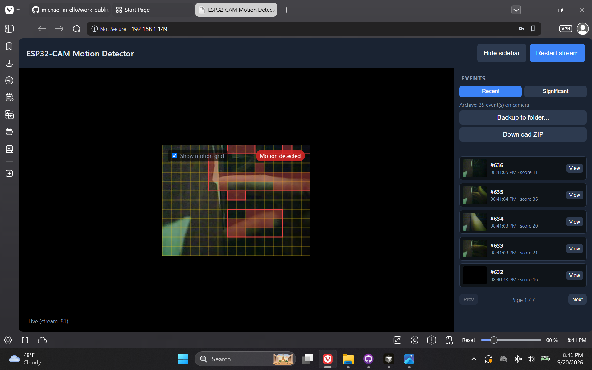

# ESP32-CAM Motion Detector

> **Repository:** `esp32-cam-motion-detector` · **Visibility:** private · **Category:** Edge AI & Embedded

AI-Thinker ESP32-CAM firmware and custom browser UI: live MJPEG stream, block-based motion detection, event thumbnails (microSD with RAM fallback), and PC backup of captured events.

---

## Inspiration

I had spare microelectronics on hand and wanted to build a custom web app plus a camera-side processing path for the basic motion-detect behaviors common in real camera systems—learning the full loop from flash tooling to on-device detection and browser review.

## Current State / Phase

Runs as intended through the phased roadmap (auth, custom UI, motion tuning, event storage, backup). Main limitation is the camera hardware itself: a smaller/cheaper module that cannot sustain a large volume of saved events compared with fuller commercial systems.

## Future Directions

Storage and retention improvements within hardware limits, optional clearer event workflows, and continued regression via on-device PowerShell phase tests.

## Stack Summary

| Area | Details |
|------|---------|
| **Primary languages** | C++, C, HTML, PowerShell |
| **Frameworks & libraries** | Arduino CLI / ESP32 core, AI-Thinker ESP32-CAM (Huge APP partition), custom `web/` UI |
| **Architecture** | Firmware HTTP + MJPEG stream · Block motion grid · Event thumbnails on SD or RAM · Browser backup |
| **Deployment hints** | CAM-MB USB programmer · `config.h` from example (Wi‑Fi/auth local only) · `scripts/build.ps1` / `flash.ps1` / `test.ps1` |

## Features

- Live MJPEG stream with motion overlay
- Tunable motion detection sliders
- Event sidebar with thumbnails
- microSD persistence with RAM fallback
- Browser backup of events (optional SD wipe for tests)
- HTTP Basic Auth / custom login and mDNS helpers

## Notable Services & Folders

- CameraWebServer/
- web/
- scripts/
- tests/

## Sanitized Directory Overview

High-level layout only — no source files, configs, or secrets are published here.

```
CameraWebServer/ — Arduino sketch / firmware/
web/ — custom camera UI (built/gzipped for device)/
scripts/ — setup, build, flash, monitor, phase tests/
tests/ — phase gates (compile + on-device where applicable)/
```

## Screenshots / Media

Example views from the application:

### Screenshot 1



### Screenshot 2



### Screenshot 3



---

[← Back to portfolio](../README.md#projects)
