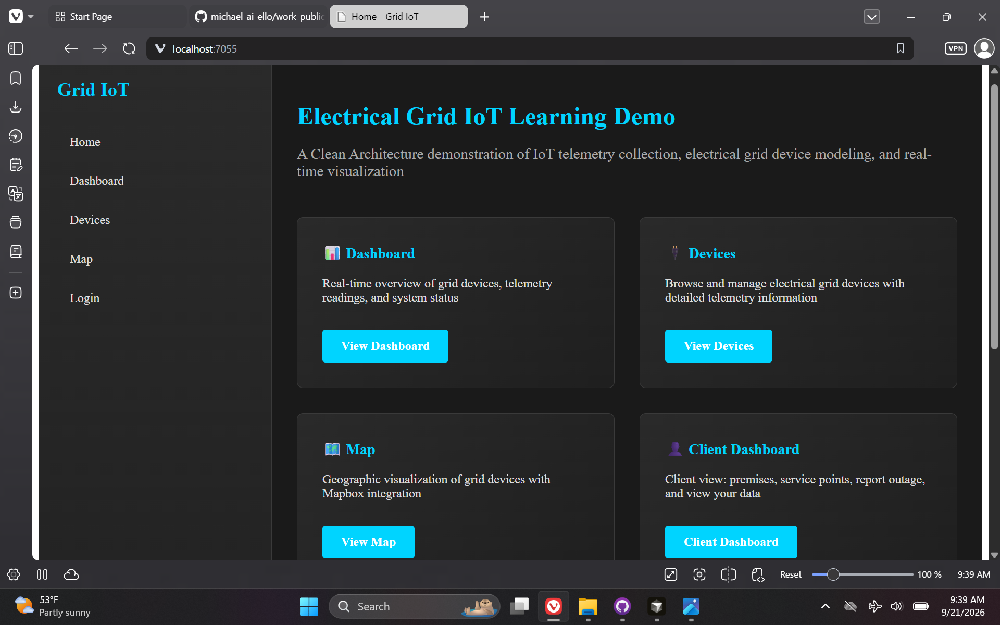
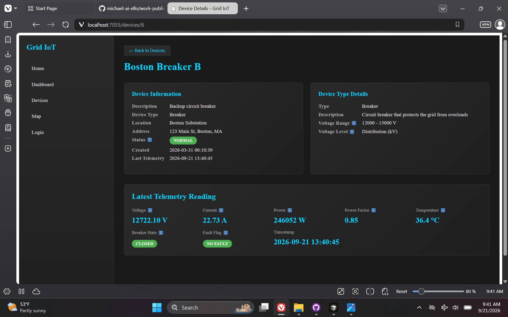
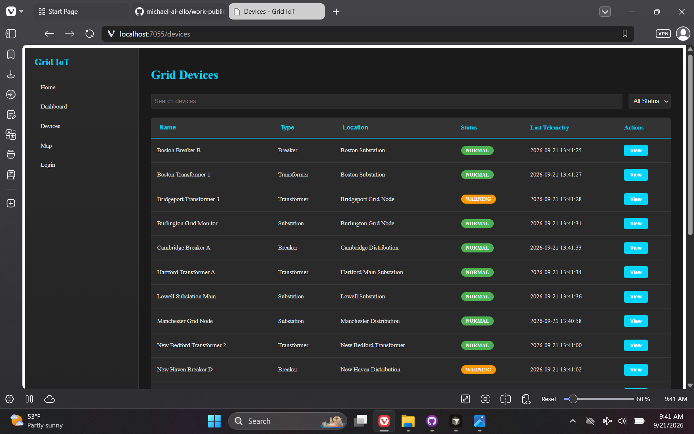
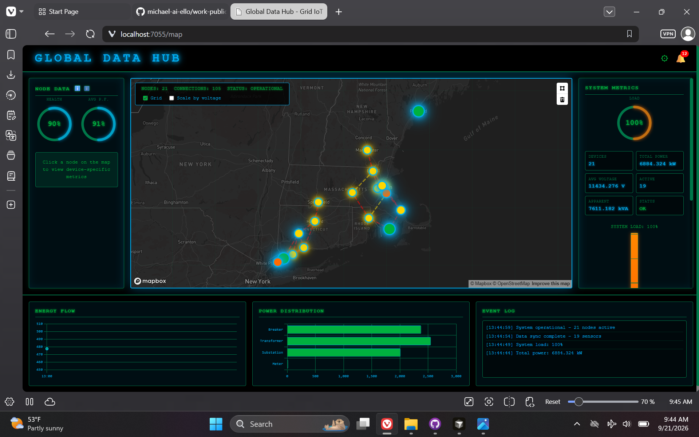
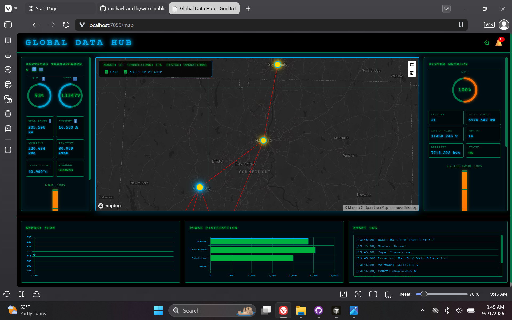

# Grid Work — Utility IoT Demo

> **Repository:** `grid-work` · **Visibility:** private · **Category:** GIS & Geospatial Systems

Grid IoT proof-of-concept: Blazor hybrid app, SQL Server telemetry, Mapbox operations map, alarms, and simulated device readings.

---

## Inspiration

While pursuing an IT software associate role at a northeastern utilities energy company, I built a POC to understand what a grid operator's application might include—GIS UI, energy informatics, and relationships between telemetry database objects.

## Current State / Phase

Functional learning codebase; in retrospect skewed toward an electrical-engineering overview more than a client-facing utility operations portal.

## Future Directions

Reframe views toward operator and customer-facing workflows; tighten integration narratives for real utility standards.

## Stack Summary

| Area | Details |
|------|---------|
| **Primary languages** | C#, HTML, TSQL, JavaScript |
| **Frameworks & libraries** | Blazor Server + WASM, ASP.NET Core Identity, Mapbox GL, EF Core (Identity only) |
| **Architecture** | Clean Architecture layers · Stored procedures for grid data · Background telemetry simulator |
| **Deployment hints** | Local SQL Server (db-grid-work) · Configurable Mapbox token · Health endpoint with SQL check |

## Features

- Device telemetry dashboard
- Map layers and alarms
- Viewer/Operator roles
- Client portal demo

## Notable Services & Folders

- grid-work.Server/
- grid-work.Client/
- GridIoT.*
- prp/

## Sanitized Directory Overview

High-level layout only — no source files, configs, or secrets are published here.

```
GridIoT.* — domain/application/infrastructure/
grid-work.Server/ — host + Identity/
prp/ — future product notes/
```

## Screenshots / Media

Example views from the application:

### Screenshot 1



### Screenshot 2



### Screenshot 3



### Screenshot 4



### Screenshot 5



---

[← Back to portfolio](../README.md#projects)
