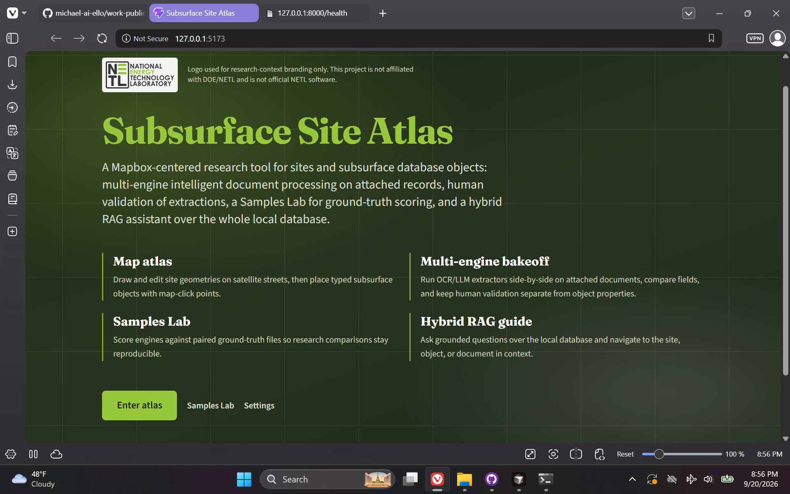
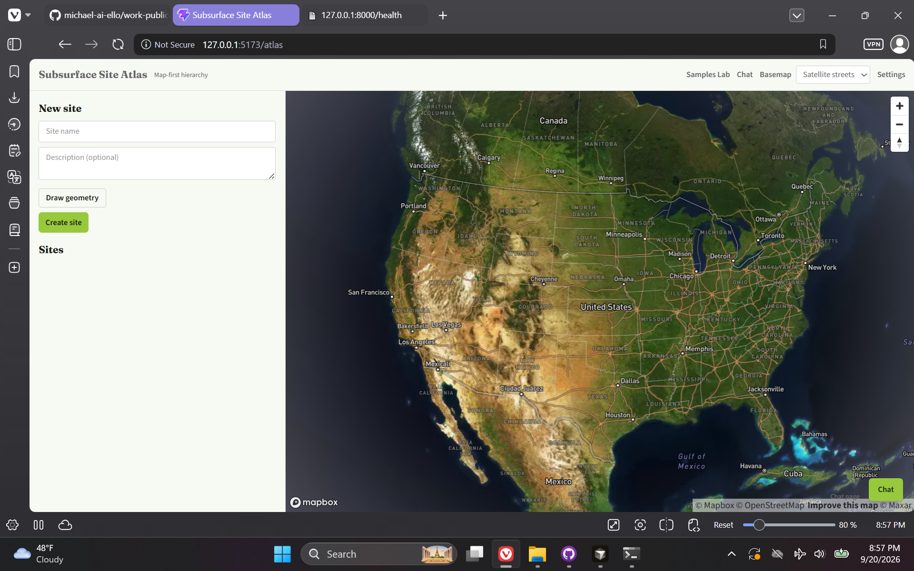
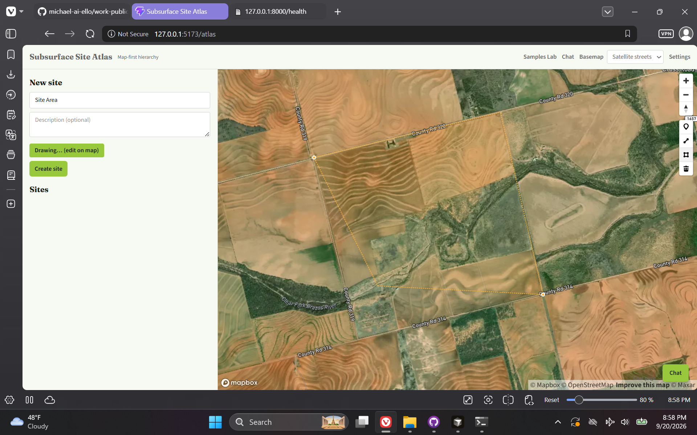
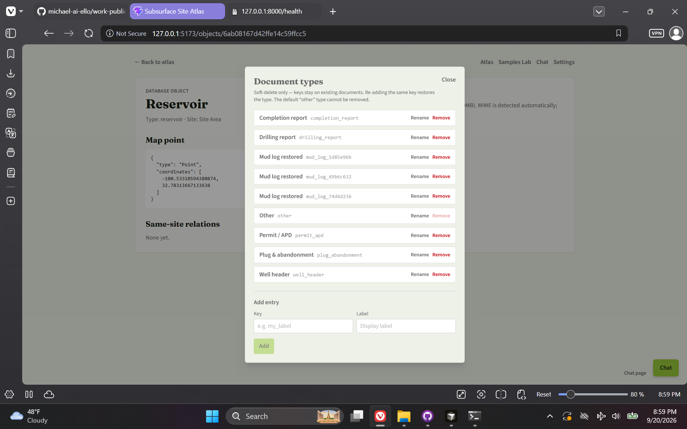
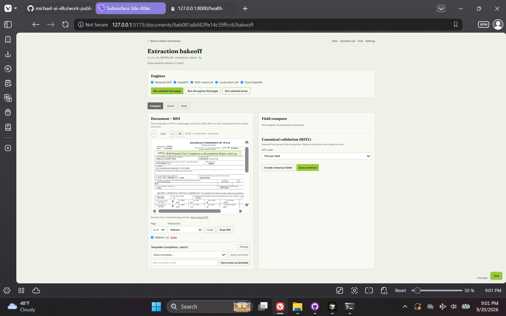

# Subsurface Site Atlas — NETL-Aligned Research POC

> **Repository:** `netl-poc` · **Visibility:** private · **Category:** Research & Geospatial Systems

Local research / simulation POC: Mapbox-centered site atlas, multi-engine intelligent document processing, human validation, Samples Lab scoring, and a path to grounded Q&A over the database.

**Not affiliated with DOE/NETL** and not official NETL software.

---

## Inspiration

Inspired by a NETL internship / research appointment description. Even without holding that role, I wanted to simulate a serious approach to an application that would support the research objective—geospatial site framing plus multi-engine IDP extract/compare/validate on subsurface-style records.

## Current State / Phase

Local full-stack demo through early product phases (site/object hierarchy, document attach, multi-engine extraction paths, review UX foundations). Setup scripts cover Windows and Linux; tests gate health and core hierarchy flows. Further phases target deeper bakeoff metrics, validation UX, and hybrid RAG navigation.

## Future Directions

Continue phased delivery: richer IDP bakeoff metrics and ground-truth Samples Lab runs, stronger human-validation workflows, and grounded Q&A / navigation over the local database.

## Stack Summary

| Area | Details |
|------|---------|
| **Primary languages** | Python, TypeScript, PowerShell, Shell |
| **Frameworks & libraries** | FastAPI, Motor/MongoDB, React 19, Vite, Mapbox GL + Draw, Tailwind, multi-engine OCR/LLM adapters |
| **Architecture** | Sites → objects → documents → extractions/jobs · Engine registry (local OCR, vision/LLM, cloud OpenAI-style) · Client atlas UI |
| **Deployment hints** | Python 3.12 + local MongoDB · `scripts/setup` / `run-app` · Mapbox and LLM keys via `.env` only (not published) |

## Features

- Mapbox site atlas with object focus (list fallback without token)
- Extensible site / object / relation hierarchy
- Multi-engine document extraction registry
- ROI / zone-oriented extraction paths
- Samples Lab ground-truth scoring direction
- Health checks for API and MongoDB

## Notable Services & Folders

- app/
- app/client/
- app/engines/
- docs/
- scripts/
- tests/

## Sanitized Directory Overview

High-level layout only — no source files, configs, or secrets are published here.

```
app/ — FastAPI service (routers, jobs, storage, engines)/
app/client/ — React + Vite Mapbox atlas UI/
docs/ — master plan and research context (disclaimer required)/
scripts/ — setup, run, stop, tests (Windows + Unix)/
tests/ — pytest gates/
vectors/ — local vector data (gitignored)/
```

## Screenshots / Media

Example views from the application:

### Screenshot 1



### Screenshot 2



### Screenshot 3



### Screenshot 4



### Screenshot 5



---

[← Back to portfolio](../README.md#projects)
