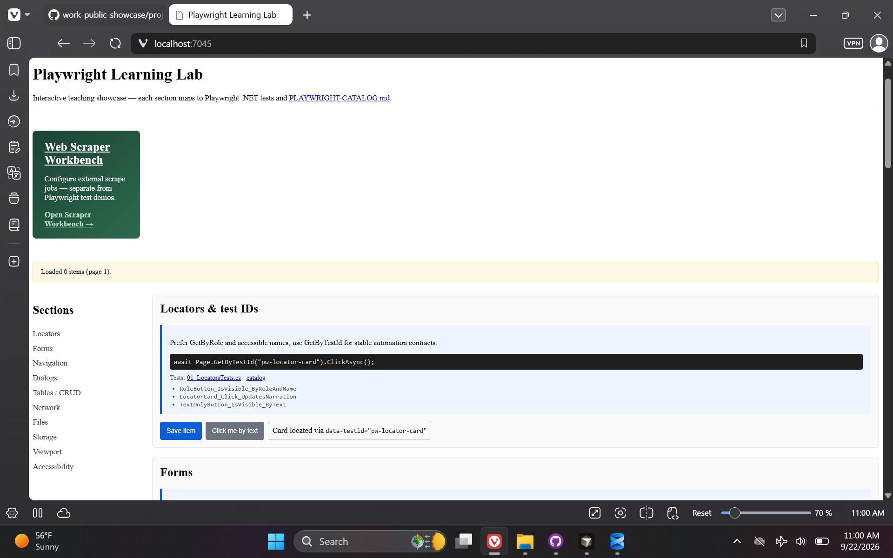
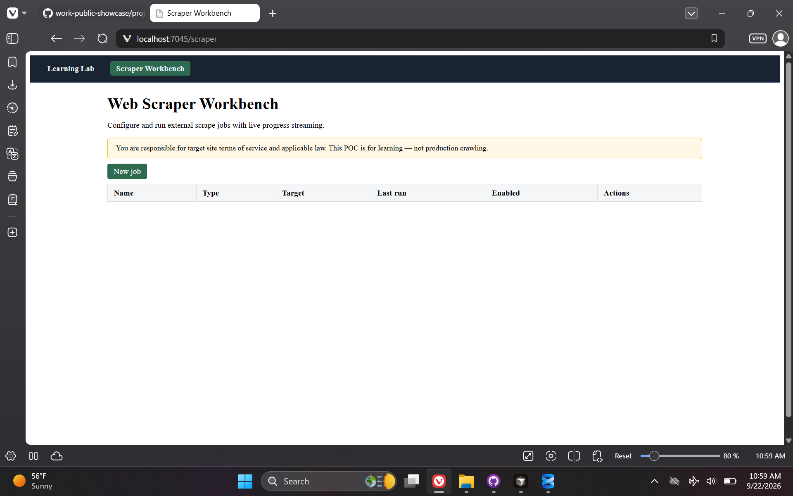

# Playwright Test — E2E Automation & Scraper POC

> **Repository:** `playwright-test` · **Visibility:** private · **Category:** Test Automation & Web Scraping

Playwright for .NET reference POC pairing a teaching-oriented Blazor app with committed E2E tests, Cursor MCP dev-time browser workflow, and a configurable Web Scraper Workbench.

---

## Inspiration

After coming across Playwright, I recognized its utility for end-to-end tests and application test automation—especially alongside the Playwright MCP tool in Cursor for interactive frontend and browser automation during development. I built this demo POC for my own learning and as reusable reference code.

The web scraping component was inspired by a scraper-based app I worked on during an internship. I wanted to reapproach that work as a more generic scraper that could support other variations and types of web data extraction—not tied to one target site or workflow.

## Current State / Phase

Phases 1–7 complete: Playwright Learning Lab (locators, forms, navigation, dialogs, CRUD, network, files, storage, accessibility), Playwright .NET E2E suite with page-object patterns, MCP workflow docs and Cursor integration, and the `/scraper` workbench with 16 job strategy types, live run logs, and guardrails. Local `scripts/test` is the regression gate; no remote CI.

## Future Directions

Optional visual regression coverage, richer scraper scheduling, and tighter production guardrails for external targets.

## Stack Summary

| Area | Details |
|------|---------|
| **Primary languages** | C#, HTML, CSS, JavaScript, PowerShell, TSQL |
| **Frameworks & libraries** | Blazor Interactive Server, Playwright .NET (NUnit), Microsoft.Playwright (runtime scraping), Dapper, SignalR, .NET 10 |
| **Architecture** | Single Blazor host · Learning Lab + Scraper Workbench routes · Strategy registry for scrape jobs · Two-layer automation (MCP dev-time + .NET E2E regression) |
| **Deployment hints** | `LOCAL-SQL-DB-CONNECTION-STRING` · SQL Server catalog `playwright-test` · Node.js 18+ for Playwright MCP in Cursor · Repo-root `scripts/` runners |

## Features

- Playwright Learning Lab with `pw-*` test IDs and teaching tooltips
- Playwright .NET E2E tests (showcase sections + API smoke + scraper CRUD/run)
- Cursor Playwright MCP workflow (`.cursor/mcp.json`, MCP-WORKFLOW docs)
- Web Scraper Workbench at `/scraper` (16 job types, live SignalR run log, artifacts)
- Phase-gated verify scripts and idempotent SQL bootstrap

## Notable Services & Folders

- src/PlaywrightShowcase.App/
- tests/PlaywrightShowcase.E2E/
- docs/
- scripts/
- .cursor/

## Sanitized Directory Overview

High-level layout only — no source files, configs, or secrets are published here.

```
src/PlaywrightShowcase.App/ — Blazor host + scraper module/
tests/PlaywrightShowcase.E2E/ — Playwright .NET tests/
docs/ — plan, MCP workflow, scraper workbench, catalog/
scripts/ — build, run, test, db, verify/
```

## Screenshots / Media

### Learning Lab



### Scraper Workbench



---

[← Back to portfolio](../README.md#projects)
