# PsyOps Intelligence — Operational POC

> **Repository:** `psyops-intelligence-poc` · **Visibility:** private · **Category:** Intelligence & Geospatial Systems

Map-centric operational proof-of-concept that reimplements and extends earlier MapBot-style workflows: medical entity foundation, threat-classified tracking on a globe map, operator assets, device placement, simulated media and neural feeds, induction and overwatch workflows, admin/AOI/SKU management, and role-based access—all with hardware layers simulated behind adapter interfaces.

---

## Inspiration

A growing recognition of government, law-enforcement, and military intelligence systems—and how those systems may interact with human populations for operational, protective, or investigative purposes—led me to rebuild a prior MapBot targeting scaffold into a fuller simulated ops surface. The goal was to practice structuring capability-gated geospatial workflows (roles, implants, assets in range, location, time) with business rules enforced in the database and mirrored on the API, without claiming real hardware or live intel feeds.

## Current State / Phase

Phases **00–19 complete** — feature-complete for demo. Medical pipeline, threat tracking, device placement, weapon and induction workflows, dissemination, calendar, admin/zone management, custom SKU builder, sentimental induction, and orbital/airship overwatch are implemented end-to-end. Test gates: **193** backend unit/integration tests and **76** Playwright specs (`./scripts/test-full`).

## Future Directions

Phase **20 (Future)** — deliberately deferred: real IoT/hardware and live data integration (physical device adapters, live GPS, camera/DSP/spectrum hardware, neural conditional-rule automation, blob storage, external intel feeds, production hardening). Current hardware paths stay simulated and clearly labeled in the UI.

## Stack Summary

| Area | Details |
|------|---------|
| **Primary languages** | C#, TypeScript, SQL, HTML, CSS, PowerShell / Bash |
| **Frameworks & libraries** | ASP.NET Core, React 19 (Vite), React Router, Dapper, PostgreSQL + PostGIS, Mapbox GL, Playwright |
| **Architecture** | Clean Architecture (Domain / Application / Infrastructure / Api) · React feature folders · Capability evaluator in PostgreSQL functions · Simulated device adapters |
| **Deployment hints** | Local PostgreSQL (not Docker) · `scripts/build`, `dbinit`, `run`, `test-full` · Mapbox token via frontend env · Secrets not published |

## Features

- Medical foundation (hospitals, births, interventions, implant catalog)
- Threat-tier tracking on Mapbox globe map with AOI search and location history
- Operator assets: weapons, DSP, cameras, birds/drones, nano insects (relay-commanded)
- Data Logger device placement, relocate, and soft-deactivate from catalog
- Weapon ops (Sight & Engage / Point & Orient) and MIL orbital/airship overwatch
- Disrupt (military) and Compromise (law enforcement) induction modes, including sentimental loads
- Simulated feeds: webcam live view, sparse implant imaging, neural text, LPR, covert mic
- Dissemination / public-watch visibility; entity and global calendar
- Admin Management: users/roles, hierarchical AOI zone groups, custom device/implant SKU builder
- Server-side RBAC — UI hiding alone is not sufficient

## Notable Services & Folders

- src/
- frontend/
- database/
- seed/
- scripts/
- tests/

## Sanitized Directory Overview

High-level layout only — no source files, configs, or secrets are published here.

```
src/ — .NET API (Clean Architecture: Domain / Application / Infrastructure / Api)/
frontend/ — React + Vite SPA (feature folders)/
database/migrations/ — PostgreSQL + PostGIS schema/
seed/ — persona / catalog / scenario seed SQL/
scripts/ — build, dbinit, migrate, run, test-* /
tests/ — unit, integration, and Playwright E2E/
```

## Screenshots / Media

### Primary UI

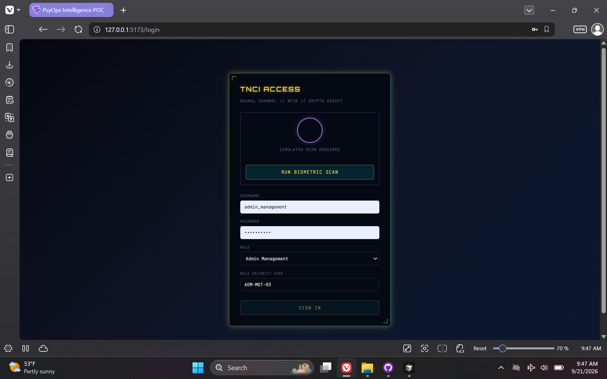

### Architecture / diagram

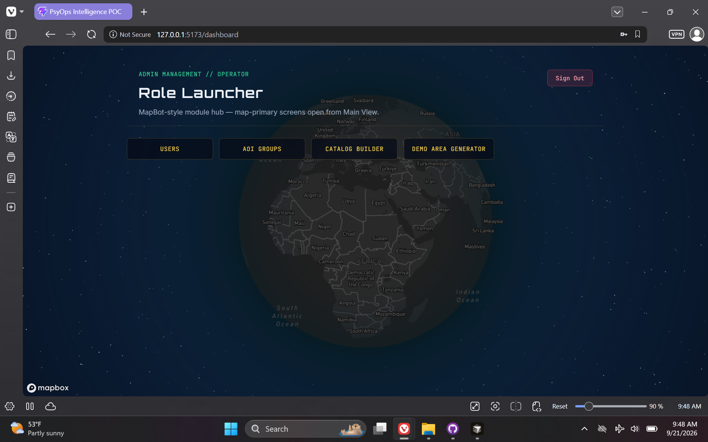

### Secondary flow

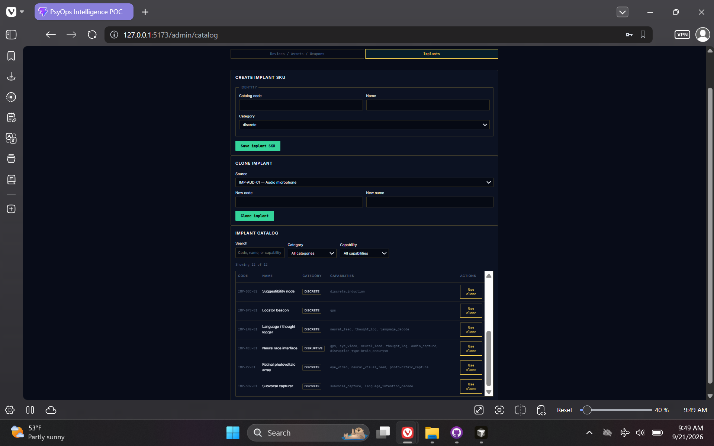

### Additional view 04

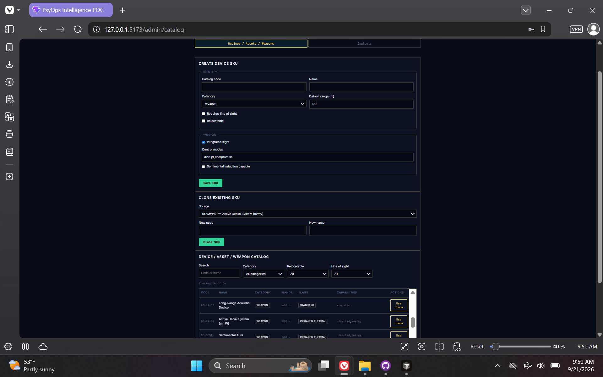

### Additional view 05

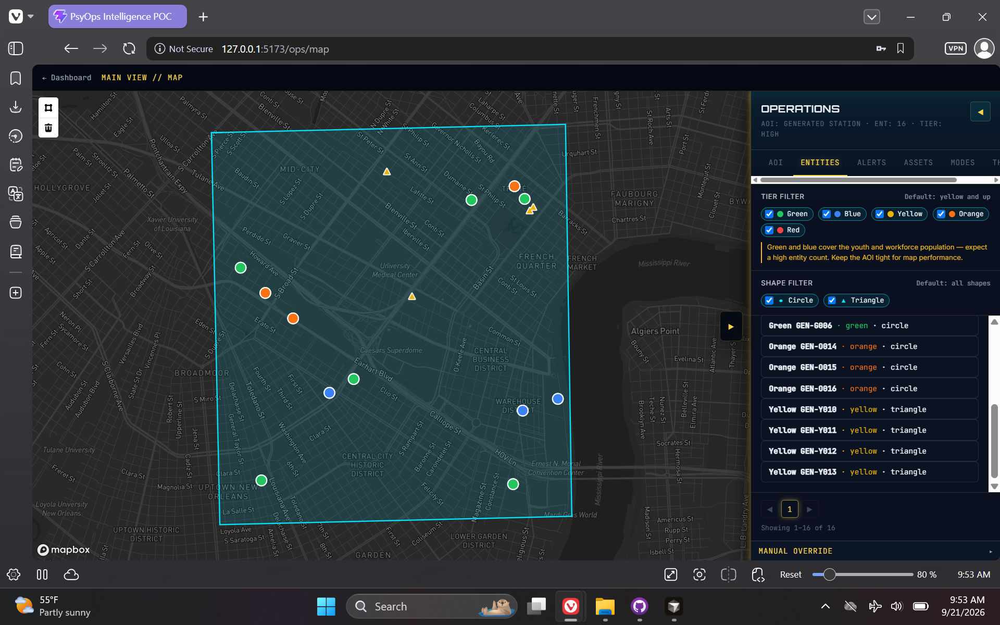

### Additional view 06

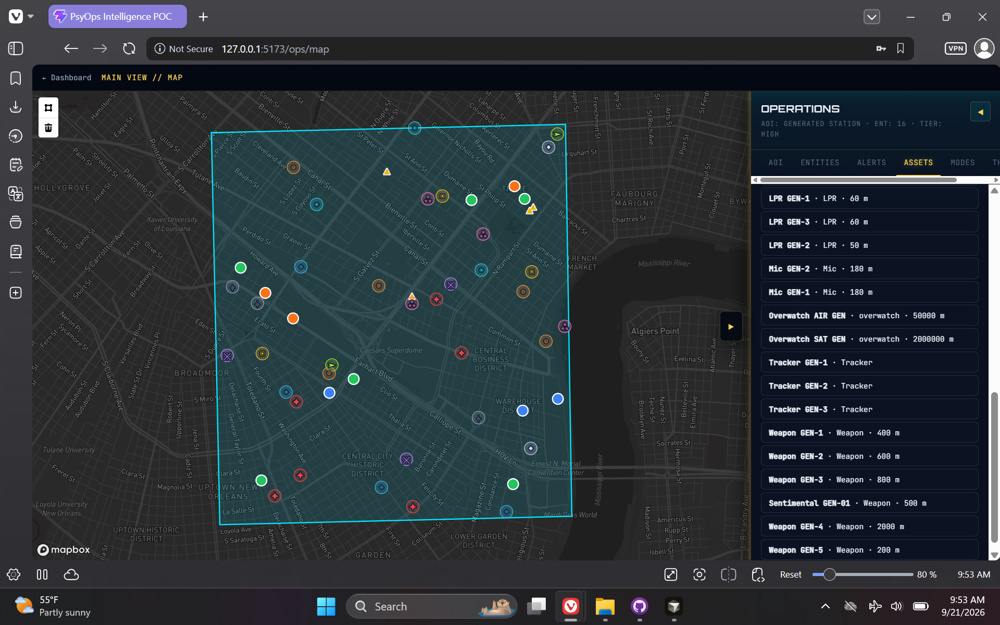

### Additional view 07

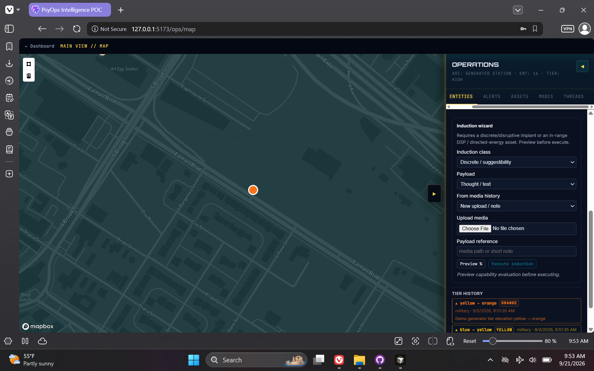

### Additional view 08

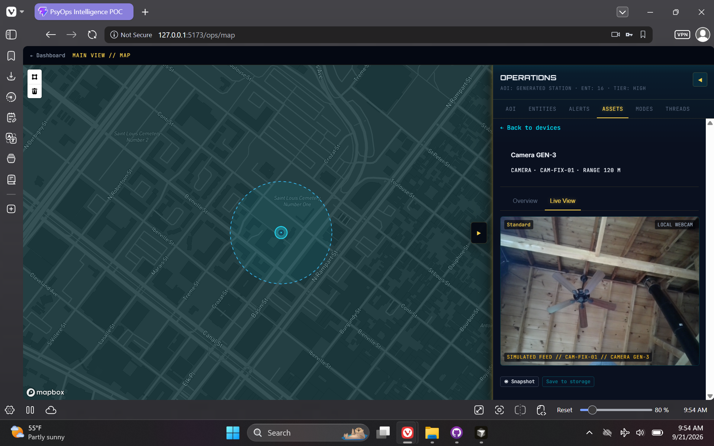

### Additional view 09

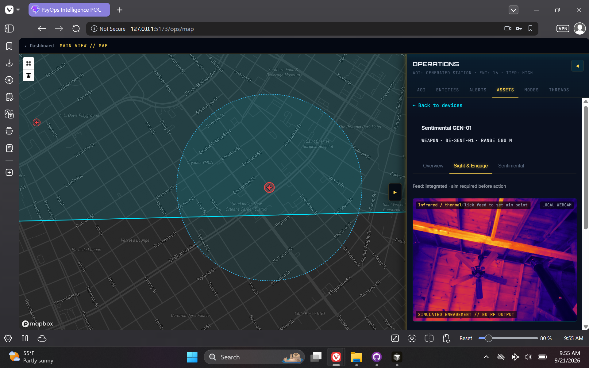

### Additional view 10

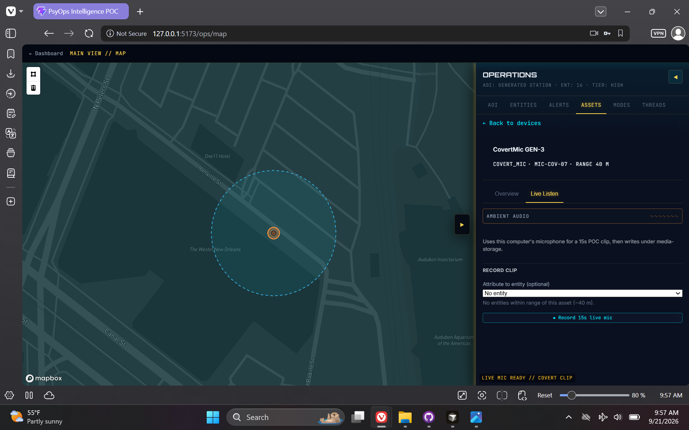

### Additional view 11

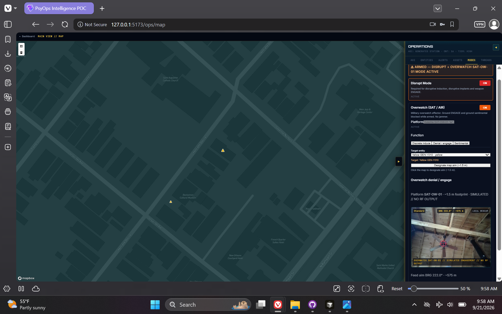

---

[← Back to portfolio](../README.md#projects)
