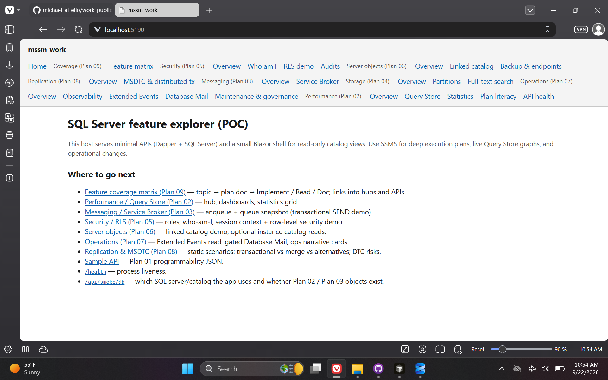
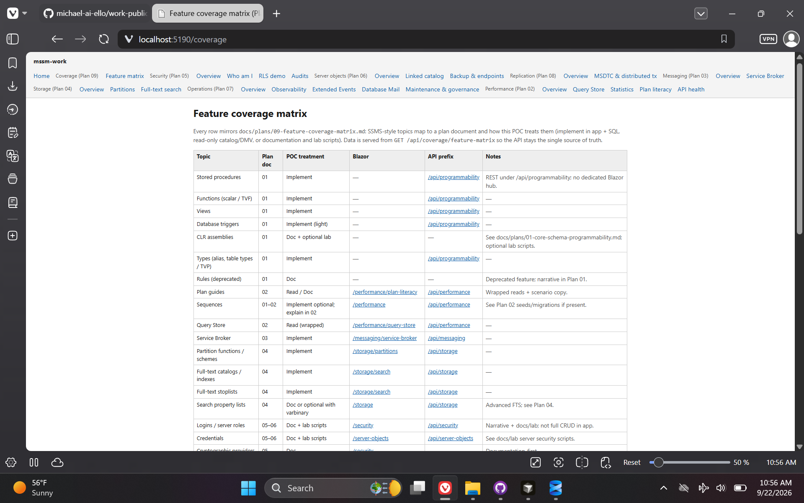
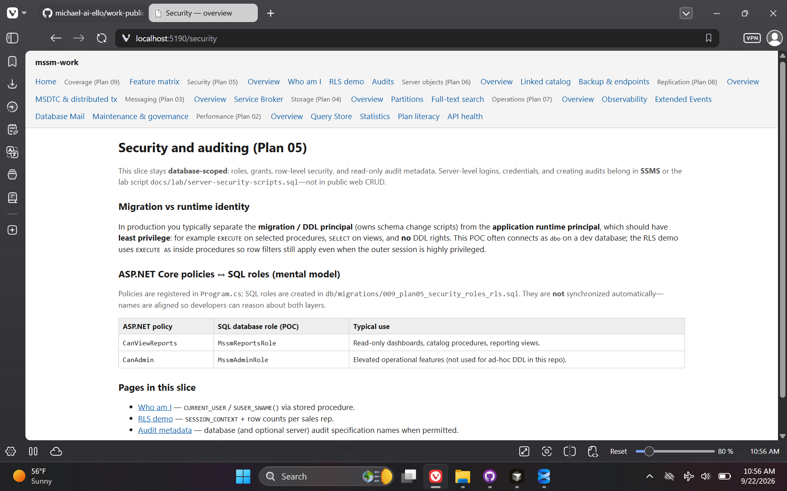
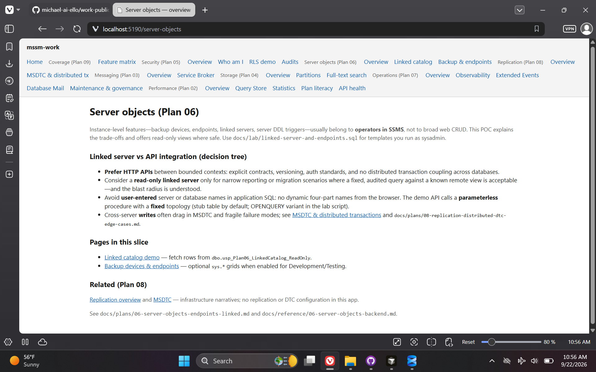
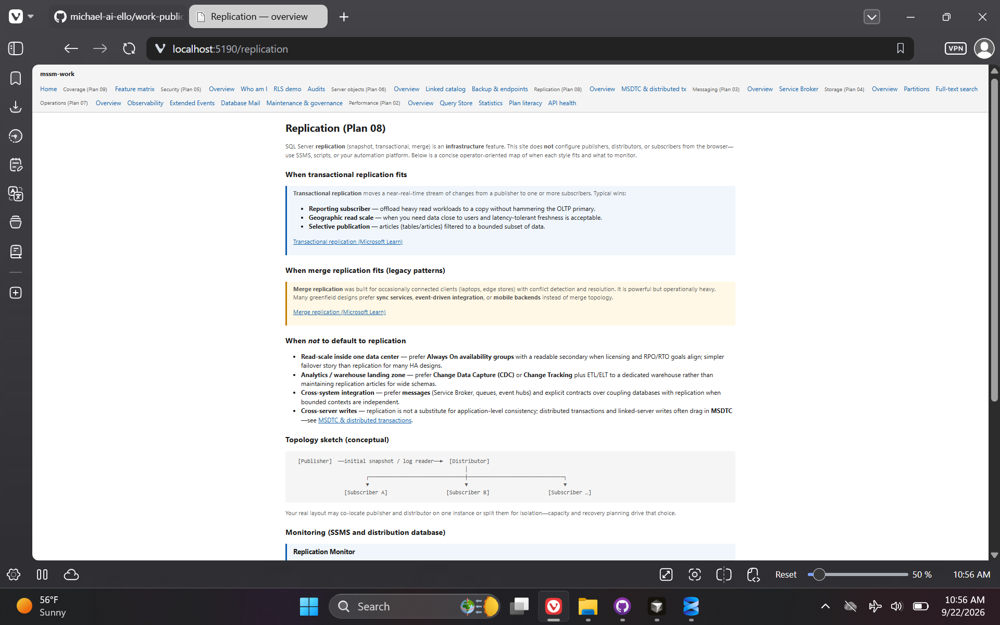
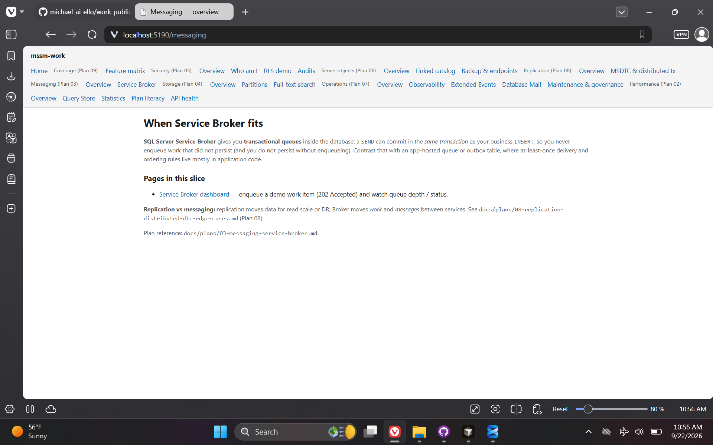
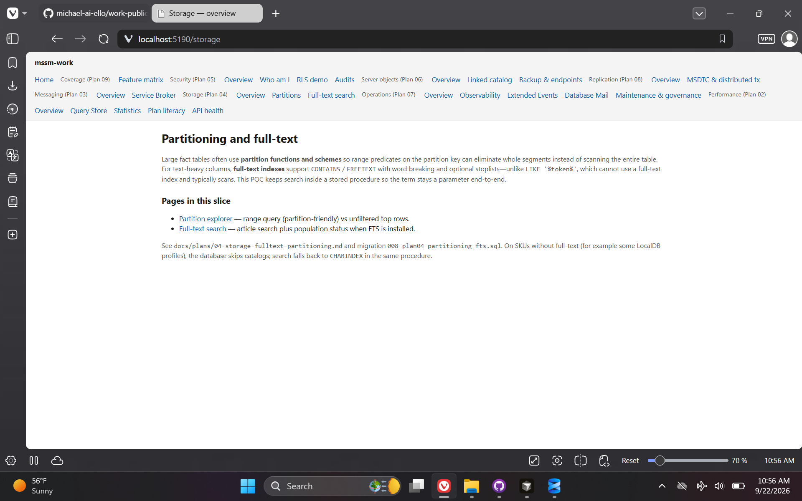
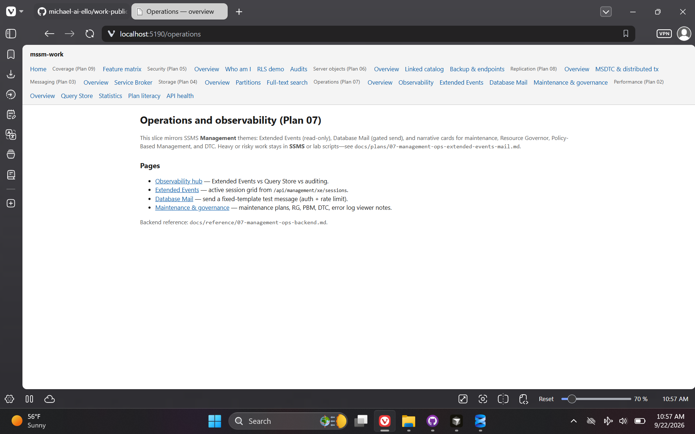
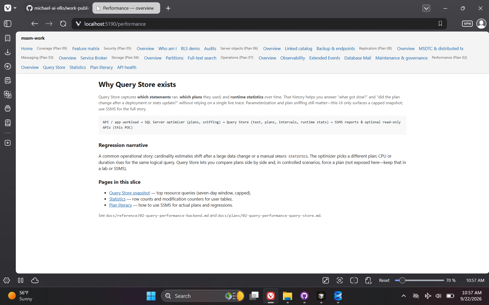

# SSMS Work — SQL Server Feature Explorer

> **Repository:** `ssms-work` · **Visibility:** private · **Category:** Data Engineering & SQL Tooling

SQL Server feature explorer POC: minimal APIs + Dapper + Blazor Interactive Server shell covering performance, security, and replication narratives.

---

## Inspiration

SQL Server Management Studio is pervasive, but I had only used tables and stored procedures—so I built a generic explorer POC to exercise other SSMS-accessible features and keep a reference codebase for future on-the-job scenarios.

## Current State / Phase

Features appear to work as intended; I am still building intuition for when each capability matters in real deployments.

## Future Directions

Deepen scenario-based docs tied to actual enterprise DBA and developer workflows.

## Stack Summary

| Area | Details |
|------|---------|
| **Primary languages** | C#, HTML, TSQL, PowerShell |
| **Frameworks & libraries** | ASP.NET Core minimal APIs, Blazor Interactive Server, Dapper |
| **Architecture** | Api + integration tests · Plan-based route modules · Env-driven connection string override |
| **Deployment hints** | LOCAL-SQL-DB-CONNECTION-STRING · db-refresh.ps1 for dev DB · Separate test database |

## Features

- /performance explorer
- /security explorer
- /replication MSDTC narrative
- Database integration tests

## Notable Services & Folders

- src/
- docs/plans/
- docs/reference/
- db/

## Sanitized Directory Overview

High-level layout only — no source files, configs, or secrets are published here.

```
src/MssmWork.Api/ — host/
docs/plans/ — phased plans/
db/ — refresh scripts/
```

## Screenshots / Media

### Primary UI



### Architecture / diagram



### Secondary flow



### Additional view 04



### Additional view 05



### Additional view 06



### Additional view 07



### Additional view 08



### Additional view 09



---

[← Back to portfolio](../README.md#projects)
