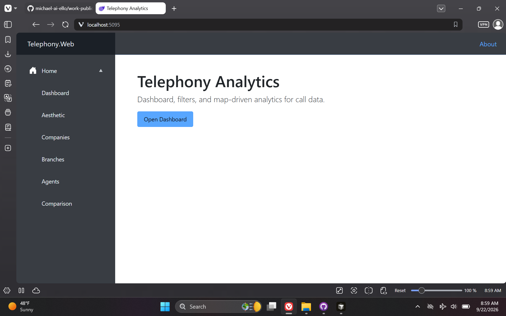
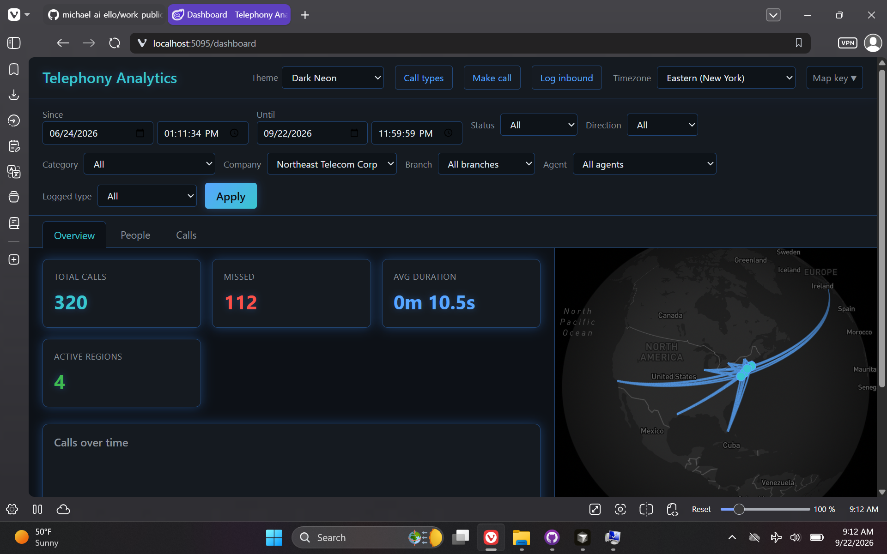
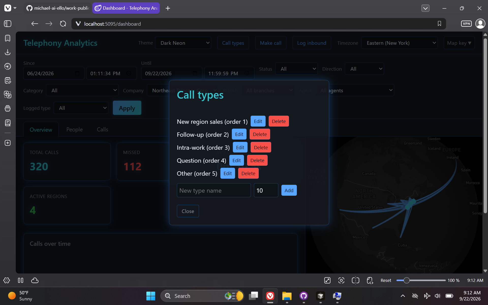
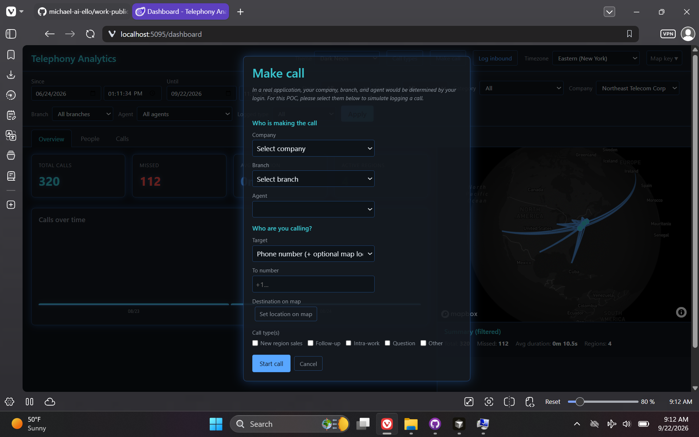
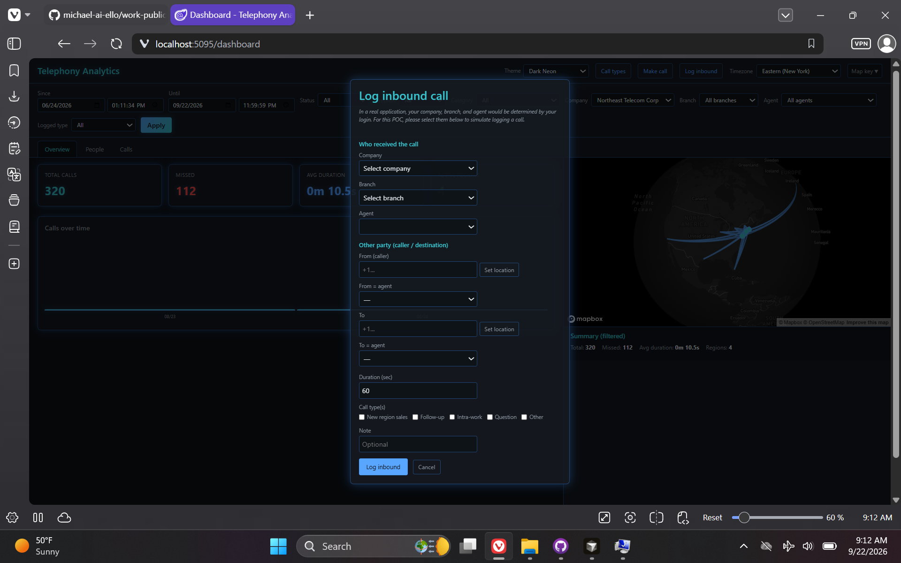
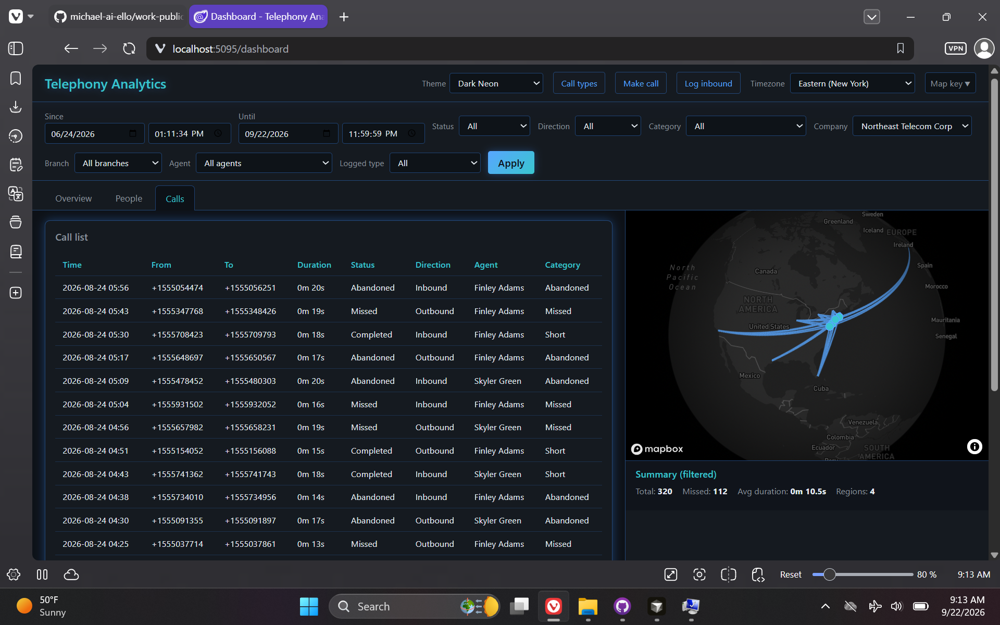
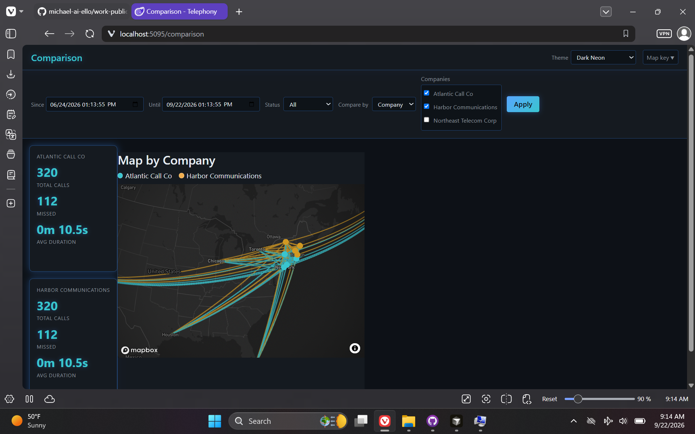

# Telephony Analytics Dashboard

> **Repository:** `telephony-work` · **Visibility:** private · **Category:** Platform, CMS & Content

Telephony-agnostic call analytics POC: normalized SQL data, ASP.NET Core API, Blazor Server dashboard with Mapbox regional views.

---

## Inspiration

After shipping Avaya-integrated sales call analytics in manufacturing production, I wanted a generic telephony POC—open adapter style, not Avaya-only—with GIS/map views for territory, call-area informatics, and cross-sector analytics.

## Current State / Phase

Working POC with mock and file-based ingestion plus regional map dashboards.

## Future Directions

Additional provider adapters and production-grade ingestion hardening per target enterprise.

## Stack Summary

| Area | Details |
|------|---------|
| **Primary languages** | C#, HTML, TSQL, CSS, JavaScript |
| **Frameworks & libraries** | Blazor Server, ASP.NET Core, EF Core, Mapbox GL |
| **Architecture** | Domain + Infrastructure adapters · Mock and file-based ingestion · GeoJSON map endpoints |
| **Deployment hints** | .NET 10 + SQL Server LocalDB · Permissive CORS for local dev |

## Features

- Call analytics dashboards
- Regional Mapbox layers
- Manual call logging
- Agent rankings

## Notable Services & Folders

- src/Telephony.Api/
- src/Telephony.Web/
- database/
- CursorContext/

## Sanitized Directory Overview

High-level layout only — no source files, configs, or secrets are published here.

```
src/Telephony.* — API, Web, Domain, Infrastructure/
database/ — idempotent schema/
CursorContext/ — design docs/
```

## Screenshots / Media

### Primary UI



### Architecture / diagram



### Secondary flow



### Additional view 04



### Additional view 05



### Additional view 06



### Additional view 07



---

[← Back to portfolio](../README.md#projects)
