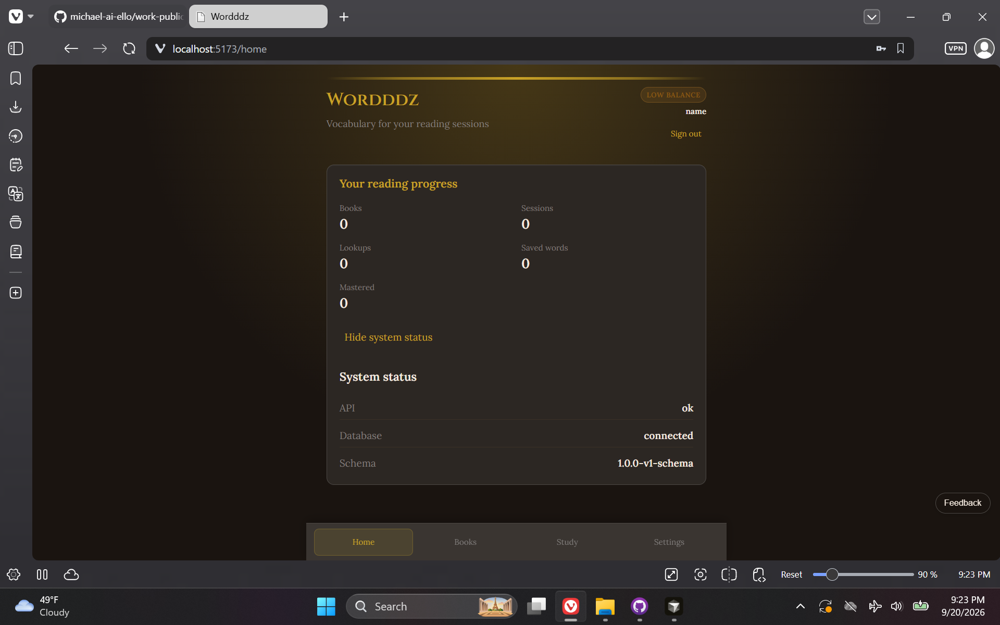
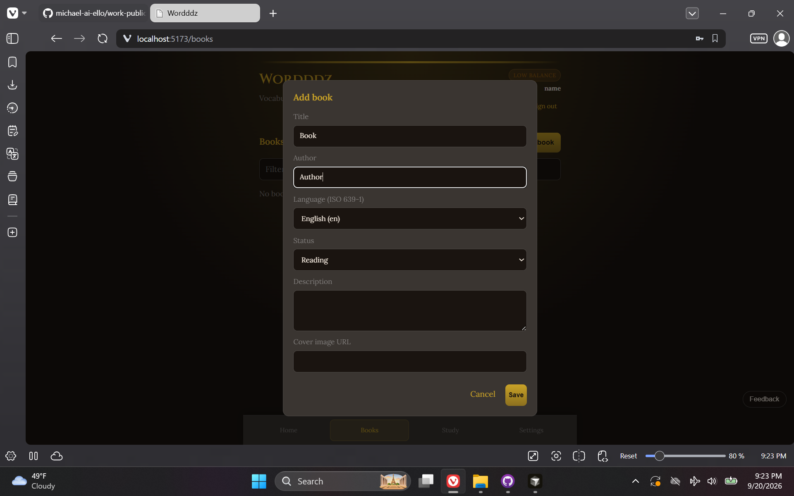
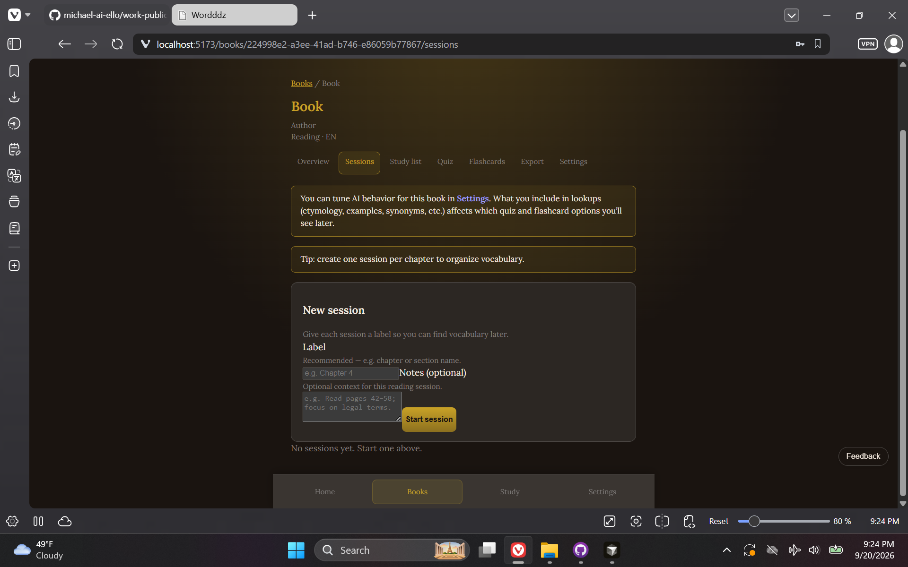
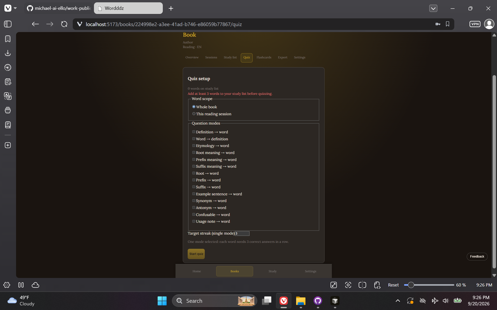
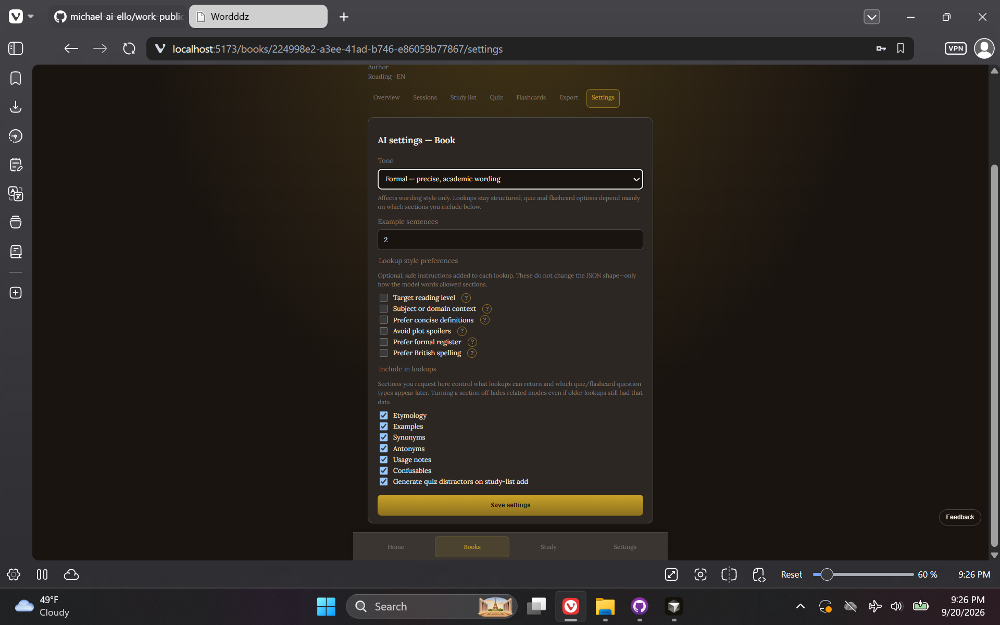
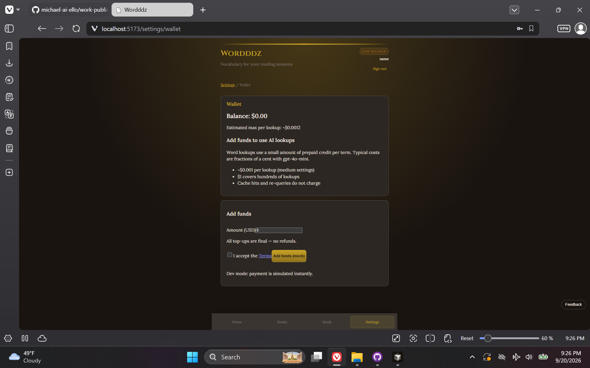

# Wordddz — Vocabulary & Reading

> **Repository:** `worddd` · **Visibility:** private · **Category:** Full-Stack Web Applications

Personal vocabulary app for active reading: AI-enriched word lookups tied to books and sessions, plus quiz and flashcard study—deployed live with wallet billing via Stripe.

---

## Inspiration

While trying to read more, I kept encountering words outside my usable lexicon. I looked them up in ChatGPT for definitions, etymology, Latin/Greek roots, prefixes, and suffixes—which helped in the moment—but retention was hard. I copied terms into Quizlet for review, which worked but split the workflow across tools. Wordddz combines lookup, study-list building, and practice into one app. It started as a tool for my own reading habit and became strong practice integrating an LLM API key into an application, standing up a VM web server reachable on the public internet, and wiring Stripe for payment.

## Current State / Phase

Live production deployment (`app.wordddz.com`) on an IONOS Ubuntu VPS with React SPA, .NET API, SQL Server, Caddy, and Stripe webhooks. Core reading-session → lookup → study → quiz/flashcard loop works end-to-end.

## Future Directions

Spaced-repetition and retention tooling, richer export formats, broader language support, and continued UX polish for mobile reading workflows.

## Stack Summary

| Area | Details |
|------|---------|
| **Primary languages** | C#, TypeScript, HTML, CSS, TSQL, Bash |
| **Frameworks & libraries** | ASP.NET Core (.NET 10), React 19, Vite, Dapper, Stripe.net, OpenAI completions, i18next |
| **Architecture** | Clean Architecture (Domain / Application / Infrastructure / Api) · React SPA + minimal API · Book → session → lookup → study list · Wallet credits for AI usage |
| **Deployment hints** | IONOS Ubuntu VPS · Caddy reverse proxy · SQL Server (Docker) · `production` deploy branch · Secrets in `/etc/worddd/` (not published) |

## Features

- Book and reading-session organization (e.g. per chapter)
- AI word lookups with structured definitions, etymology, and roots
- Study lists, quizzes, and flashcards (LLM-assisted distractor generation)
- Wallet credits and Stripe checkout / webhooks
- Admin dashboard (users, AI key, prompts, feedback)
- Theming, i18n (EN/ES), and study-set export

## Notable Services & Folders

- src/
- frontend/
- database/
- docs/deploy/
- scripts/deploy/

## Sanitized Directory Overview

High-level layout only — no source files, configs, or secrets are published here.

```
src/ — .NET API (Clean Architecture)/
frontend/ — React + Vite SPA/
database/ — schema and seed assets/
docs/deploy/ — VM runbook and Caddy examples/
scripts/deploy/ — Ubuntu sync and build scripts/
```

## Screenshots / Media

### Primary UI



### Architecture / diagram



### Secondary flow



### Additional view 04



### Additional view 05



### Additional view 06



---

[← Back to portfolio](../README.md#projects)
